# Diagramas

Diagramas de la app en [Mermaid](https://mermaid.js.org/). GitHub los dibuja
directamente al abrir este archivo. La explicación de cada pieza está en
[ARQUITECTURA.md](ARQUITECTURA.md).

- [Arquitectura general](#arquitectura-general)
- [Capas del frontend](#capas-del-frontend)
- [Navegación y permisos](#navegación-y-permisos)
- [Inicio de sesión](#inicio-de-sesión)
- [Invitación por enlace o QR](#invitación-por-enlace-o-qr)
- [Recuperación de contraseña](#recuperación-de-contraseña)
- [Subida de fotos](#subida-de-fotos)
- [Notitas, chat y notificaciones](#notitas-chat-y-notificaciones)
- [Chat: respuestas, conexión y vistos](#chat-respuestas-conexión-y-vistos)
- [Chat: fotos y stickers](#chat-fotos-y-stickers)
- [Avisos en el celular](#avisos-en-el-celular)
- [Colores por persona](#colores-por-persona)
- [Perfil de cada persona](#perfil-de-cada-persona)
- [Listas compartidas](#listas-compartidas)
- [Tutorial guiado](#tutorial-guiado)
- [Integración y despliegue](#integración-y-despliegue)
- [Modelo de datos](#modelo-de-datos)
- [Roles y permisos](#roles-y-permisos)

## Arquitectura general

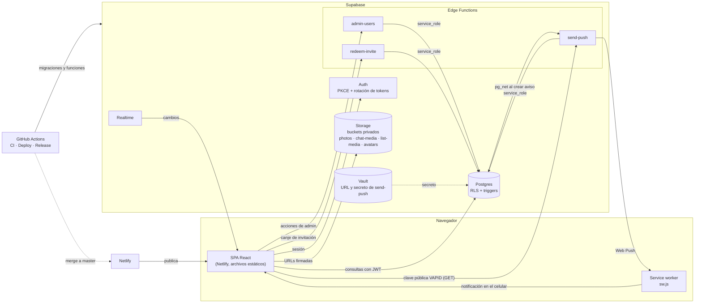
```mermaid
flowchart LR
  subgraph Navegador
    SPA["SPA React<br/>(Netlify, archivos estáticos)"]
    SW["Service worker<br/>sw.js"]
  end
  subgraph Supabase
    AUTH["Auth<br/>PKCE + rotación de tokens"]
    DB[("Postgres<br/>RLS + triggers")]
    ST[("Storage<br/>buckets privados<br/>photos · chat-media · list-media · avatars")]
    RT["Realtime"]
    VA[("Vault<br/>URL y secreto de send-push")]
    subgraph Edge["Edge Functions"]
      AU["admin-users"]
      RI["redeem-invite"]
      SP["send-push"]
    end
  end
  GH["GitHub Actions<br/>CI · Deploy · Release"]
  NL["Netlify"]

  SPA -- "sesión" --> AUTH
  SPA -- "consultas con JWT" --> DB
  SPA -- "URLs firmadas" --> ST
  RT -- "cambios" --> SPA
  SPA -- "acciones de admin" --> AU
  SPA -- "canje de invitación" --> RI
  DB -- "pg_net al crear aviso" --> SP
  VA -. "secreto" .-> DB
  SPA -- "clave pública VAPID (GET)" --> SP
  SP -- "Web Push" --> SW
  SW -- "notificación en el celular" --> SPA
  AU & RI & SP -- "service_role" --> DB
  GH -- "migraciones y funciones" --> Supabase
  GH -. "merge a master" .-> NL
  NL -- "publica" --> SPA
```

## Capas del frontend

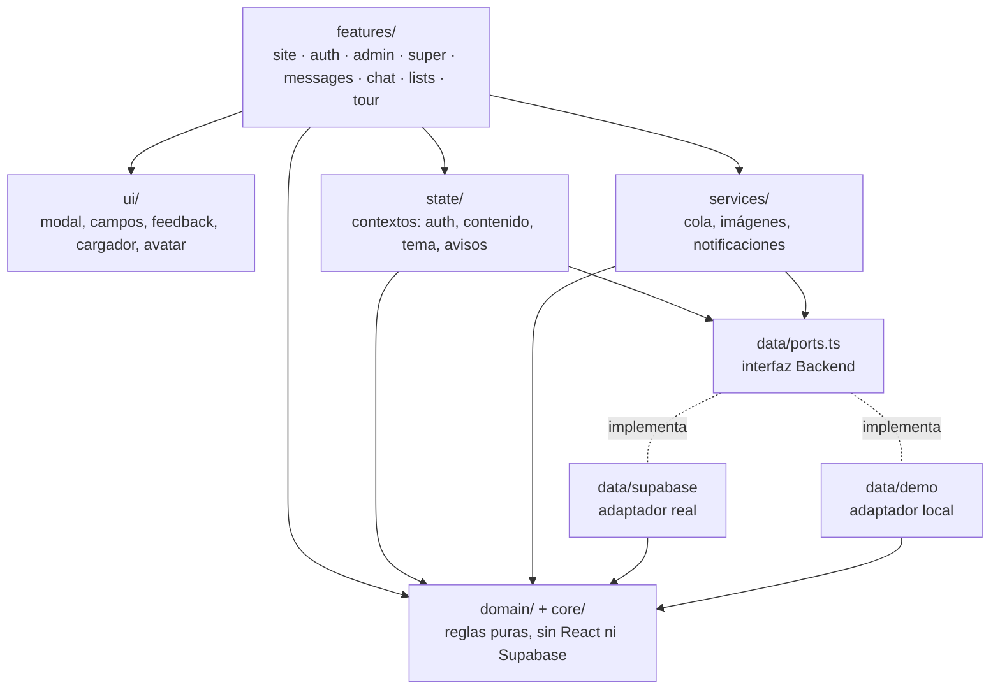
```mermaid
flowchart TB
  F["features/<br/>site · auth · admin · super · messages · chat · lists · tour"]
  UI["ui/<br/>modal, campos, feedback, cargador, avatar"]
  S["state/<br/>contextos: auth, contenido, tema, avisos"]
  SV["services/<br/>cola, imágenes, notificaciones"]
  P["data/ports.ts<br/>interfaz Backend"]
  A1["data/supabase<br/>adaptador real"]
  A2["data/demo<br/>adaptador local"]
  D["domain/ + core/<br/>reglas puras, sin React ni Supabase"]

  F --> UI & S & SV & D
  S --> P
  SV --> P
  P -. "implementa" .- A1
  P -. "implementa" .- A2
  S & SV & A1 & A2 --> D
```

## Navegación y permisos

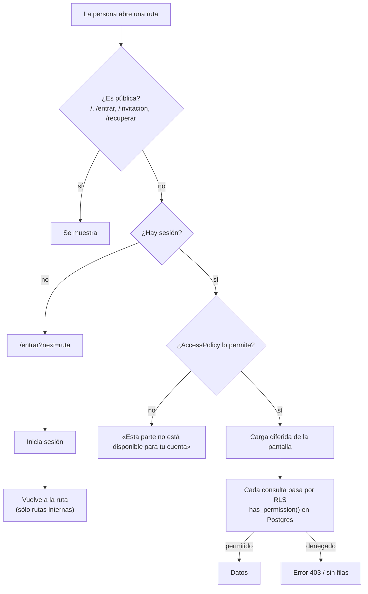
```mermaid
flowchart TD
  A["La persona abre una ruta"] --> B{"¿Es pública?<br/>/, /entrar, /invitacion, /recuperar"}
  B -- "sí" --> P["Se muestra"]
  B -- "no" --> C{"¿Hay sesión?"}
  C -- "no" --> L["/entrar?next=ruta"]
  L --> LG["Inicia sesión"] --> R["Vuelve a la ruta<br/>(sólo rutas internas)"]
  C -- "sí" --> D{"¿AccessPolicy lo permite?"}
  D -- "no" --> E["«Esta parte no está disponible para tu cuenta»"]
  D -- "sí" --> F["Carga diferida de la pantalla"]
  F --> G["Cada consulta pasa por RLS<br/>has_permission() en Postgres"]
  G -- "permitido" --> OK["Datos"]
  G -- "denegado" --> X["Error 403 / sin filas"]
```

## Inicio de sesión

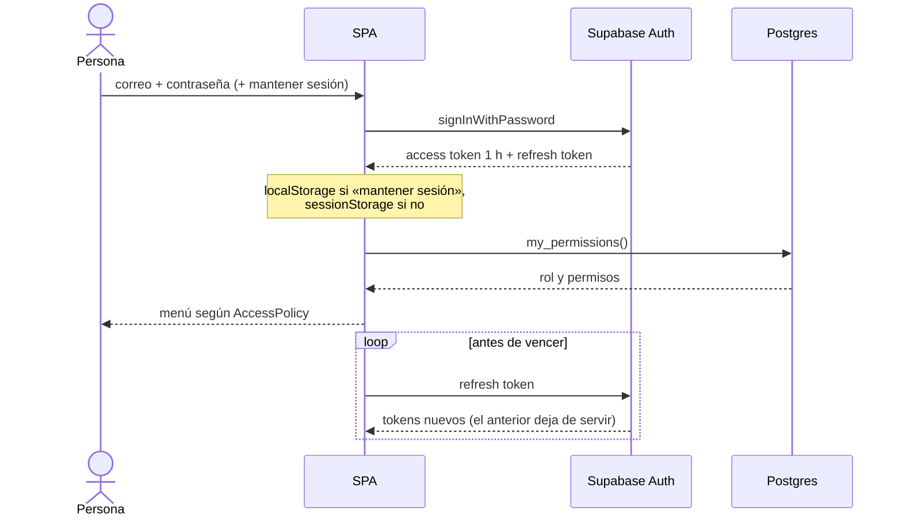
```mermaid
sequenceDiagram
  actor U as Persona
  participant App as SPA
  participant Auth as Supabase Auth
  participant DB as Postgres

  U->>App: correo + contraseña (+ mantener sesión)
  App->>Auth: signInWithPassword
  Auth-->>App: access token 1 h + refresh token
  Note over App: localStorage si «mantener sesión»,<br/>sessionStorage si no
  App->>DB: my_permissions()
  DB-->>App: rol y permisos
  App-->>U: menú según AccessPolicy
  loop antes de vencer
    App->>Auth: refresh token
    Auth-->>App: tokens nuevos (el anterior deja de servir)
  end
```

## Invitación por enlace o QR

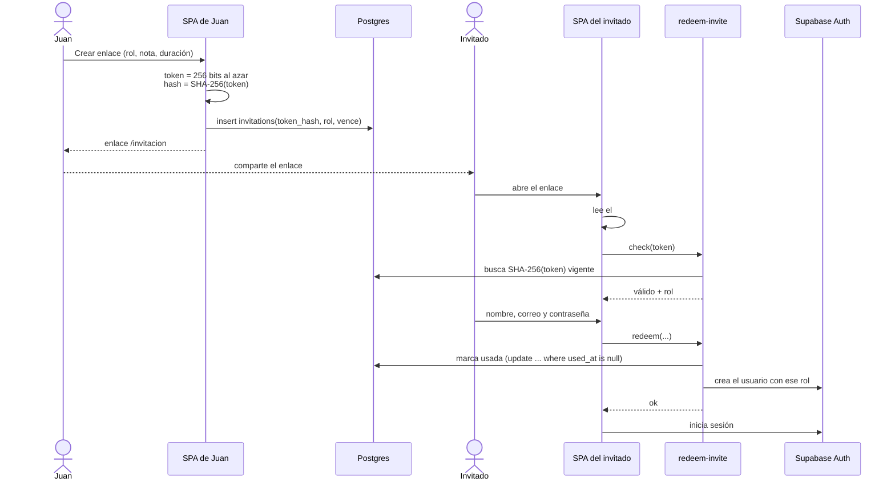
```mermaid
sequenceDiagram
  actor J as Juan
  participant App as SPA de Juan
  participant DB as Postgres
  actor I as Invitado
  participant App2 as SPA del invitado
  participant RI as redeem-invite
  participant Auth as Supabase Auth

  J->>App: Crear enlace (rol, nota, duración)
  App->>App: token = 256 bits al azar<br/>hash = SHA-256(token)
  App->>DB: insert invitations(token_hash, rol, vence)
  App-->>J: enlace /invitacion#token y QR
  J-->>I: comparte el enlace
  I->>App2: abre el enlace
  App2->>App2: lee el #fragmento y lo borra de la barra
  App2->>RI: check(token)
  RI->>DB: busca SHA-256(token) vigente
  RI-->>App2: válido + rol
  I->>App2: nombre, correo y contraseña
  App2->>RI: redeem(...)
  RI->>DB: marca usada (update ... where used_at is null)
  RI->>Auth: crea el usuario con ese rol
  RI-->>App2: ok
  App2->>Auth: inicia sesión
```

## Recuperación de contraseña

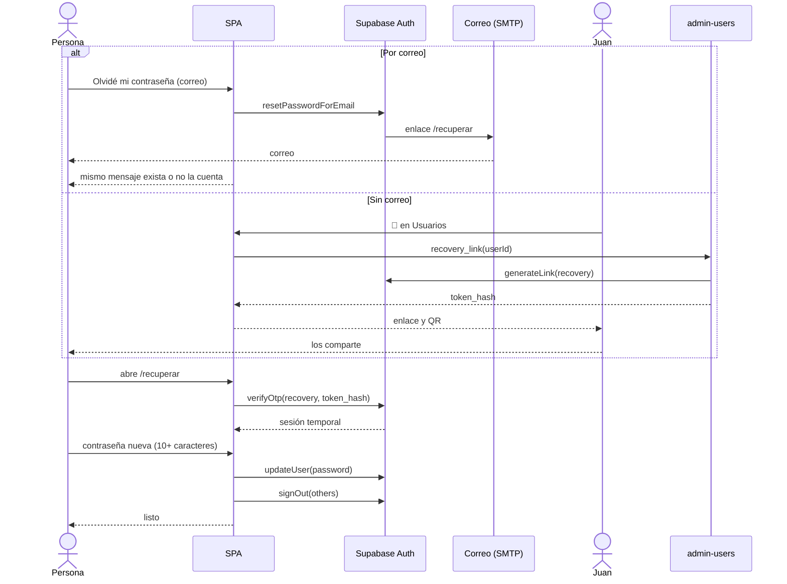
```mermaid
sequenceDiagram
  actor U as Persona
  participant App as SPA
  participant Auth as Supabase Auth
  participant Mail as Correo (SMTP)
  actor J as Juan
  participant AU as admin-users

  alt Por correo
    U->>App: Olvidé mi contraseña (correo)
    App->>Auth: resetPasswordForEmail
    Auth->>Mail: enlace /recuperar#token_hash
    Mail-->>U: correo
    App-->>U: mismo mensaje exista o no la cuenta
  else Sin correo
    J->>App: 🔑 en Usuarios
    App->>AU: recovery_link(userId)
    AU->>Auth: generateLink(recovery)
    AU-->>App: token_hash
    App-->>J: enlace y QR
    J-->>U: los comparte
  end
  U->>App: abre /recuperar#token_hash
  App->>Auth: verifyOtp(recovery, token_hash)
  Auth-->>App: sesión temporal
  U->>App: contraseña nueva (10+ caracteres)
  App->>Auth: updateUser(password)
  App->>Auth: signOut(others)
  App-->>U: listo
```

## Subida de fotos

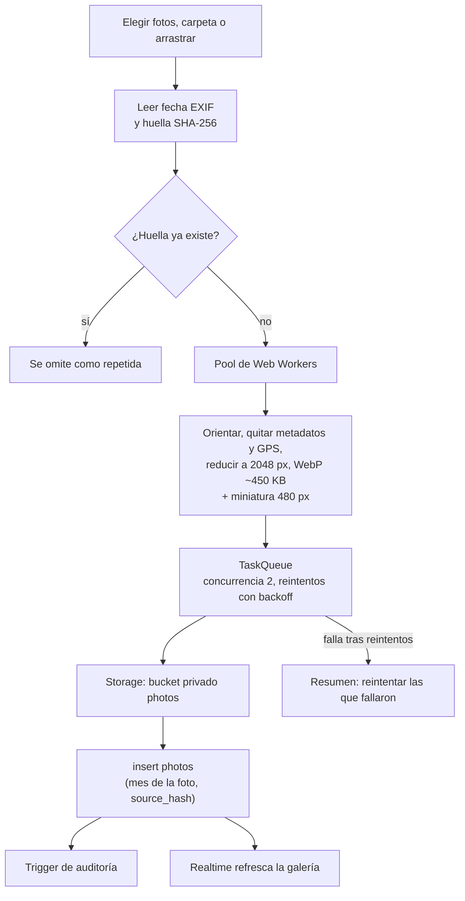
```mermaid
flowchart TD
  A["Elegir fotos, carpeta o arrastrar"] --> B["Leer fecha EXIF<br/>y huella SHA-256"]
  B --> C{"¿Huella ya existe?"}
  C -- "sí" --> SKIP["Se omite como repetida"]
  C -- "no" --> D["Pool de Web Workers"]
  D --> E["Orientar, quitar metadatos y GPS,<br/>reducir a 2048 px, WebP ~450 KB<br/>+ miniatura 480 px"]
  E --> Q["TaskQueue<br/>concurrencia 2, reintentos con backoff"]
  Q --> U["Storage: bucket privado photos"]
  U --> R["insert photos<br/>(mes de la foto, source_hash)"]
  R --> T["Trigger de auditoría"]
  R --> RT["Realtime refresca la galería"]
  Q -- "falla tras reintentos" --> F["Resumen: reintentar las que fallaron"]
```

## Notitas, chat y notificaciones

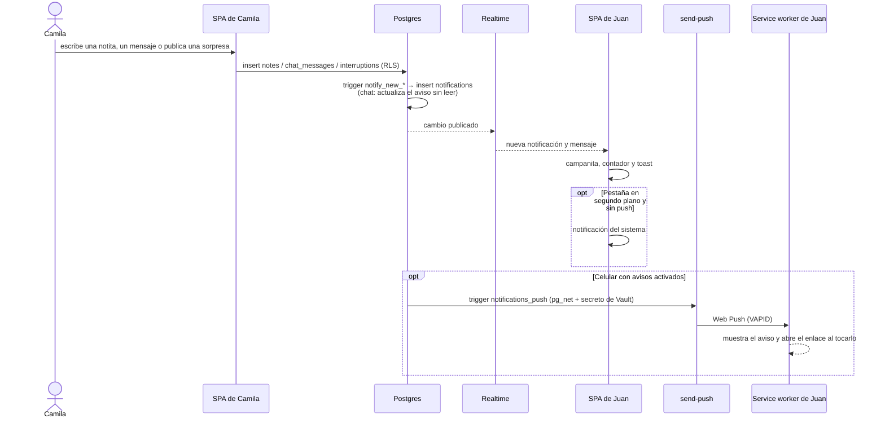
```mermaid
sequenceDiagram
  actor C as Camila
  participant A as SPA de Camila
  participant DB as Postgres
  participant RT as Realtime
  participant B as SPA de Juan
  participant SP as send-push
  participant SW as Service worker de Juan

  C->>A: escribe una notita, un mensaje o publica una sorpresa
  A->>DB: insert notes / chat_messages / interruptions (RLS)
  DB->>DB: trigger notify_new_* → insert notifications<br/>(chat: actualiza el aviso sin leer)
  DB-->>RT: cambio publicado
  RT-->>B: nueva notificación y mensaje
  B->>B: campanita, contador y toast
  opt Pestaña en segundo plano y sin push
    B->>B: notificación del sistema
  end
  opt Celular con avisos activados
    DB->>SP: trigger notifications_push (pg_net + secreto de Vault)
    SP->>SW: Web Push (VAPID)
    SW-->>SW: muestra el aviso y abre el enlace al tocarlo
  end
```

## Chat: respuestas, conexión y vistos

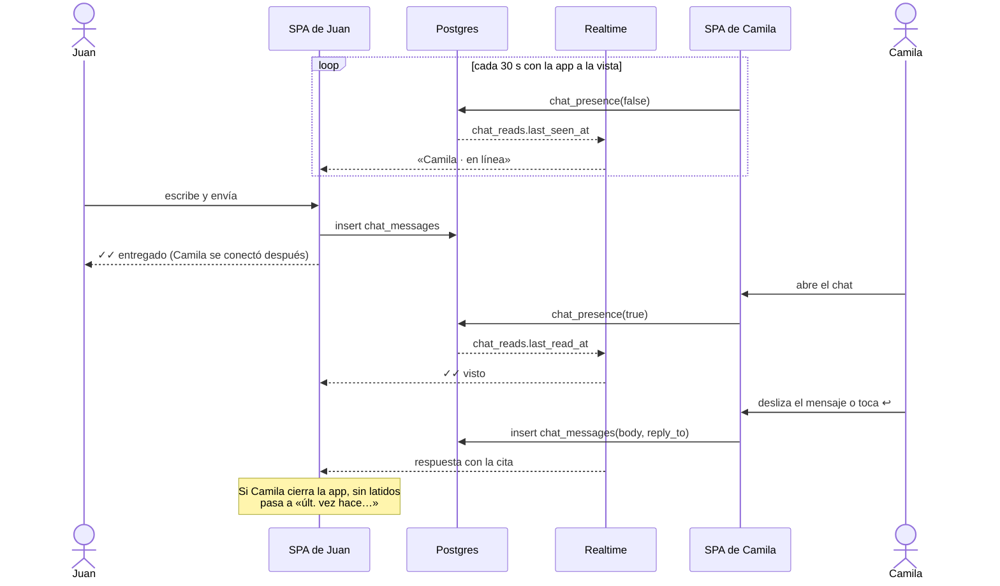
```mermaid
sequenceDiagram
  actor J as Juan
  participant A as SPA de Juan
  participant DB as Postgres
  participant RT as Realtime
  participant B as SPA de Camila
  actor C as Camila

  loop cada 30 s con la app a la vista
    B->>DB: chat_presence(false)
    DB-->>RT: chat_reads.last_seen_at
    RT-->>A: «Camila · en línea»
  end
  J->>A: escribe y envía
  A->>DB: insert chat_messages
  A-->>J: ✓✓ entregado (Camila se conectó después)
  C->>B: abre el chat
  B->>DB: chat_presence(true)
  DB-->>RT: chat_reads.last_read_at
  RT-->>A: ✓✓ visto
  C->>B: desliza el mensaje o toca ↩
  B->>DB: insert chat_messages(body, reply_to)
  RT-->>A: respuesta con la cita
  Note over A: Si Camila cierra la app, sin latidos<br/>pasa a «últ. vez hace…»
```

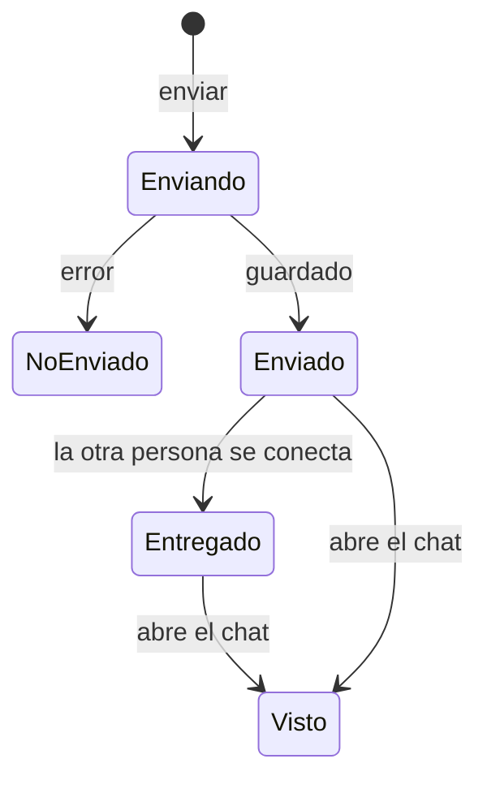
```mermaid
stateDiagram-v2
  [*] --> Enviando: enviar
  Enviando --> NoEnviado: error
  Enviando --> Enviado: guardado
  Enviado --> Entregado: la otra persona se conecta
  Entregado --> Visto: abre el chat
  Enviado --> Visto: abre el chat
```

## Chat: fotos y stickers

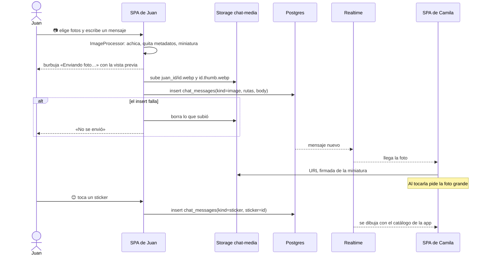
```mermaid
sequenceDiagram
  actor J as Juan
  participant A as SPA de Juan
  participant S as Storage chat-media
  participant DB as Postgres
  participant RT as Realtime
  participant B as SPA de Camila

  J->>A: 📷 elige fotos y escribe un mensaje
  A->>A: ImageProcessor: achica, quita metadatos, miniatura
  A-->>J: burbuja «Enviando foto…» con la vista previa
  A->>S: sube juan_id/id.webp y id.thumb.webp
  A->>DB: insert chat_messages(kind=image, rutas, body)
  alt el insert falla
    A->>S: borra lo que subió
    A-->>J: «No se envió»
  end
  DB-->>RT: mensaje nuevo
  RT-->>B: llega la foto
  B->>S: URL firmada de la miniatura
  Note over B: Al tocarla pide la foto grande
  J->>A: 😊 toca un sticker
  A->>DB: insert chat_messages(kind=sticker, sticker=id)
  RT-->>B: se dibuja con el catálogo de la app
```

## Avisos en el celular

Activar los avisos en un dispositivo:

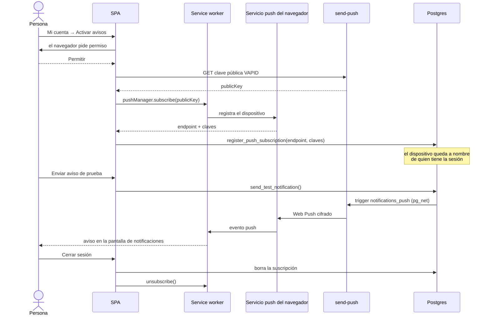
```mermaid
sequenceDiagram
  actor P as Persona
  participant App as SPA
  participant SW as Service worker
  participant PS as Servicio push del navegador
  participant SP as send-push
  participant DB as Postgres

  P->>App: Mi cuenta → Activar avisos
  App->>P: el navegador pide permiso
  P-->>App: Permitir
  App->>SP: GET clave pública VAPID
  SP-->>App: publicKey
  App->>SW: pushManager.subscribe(publicKey)
  SW->>PS: registra el dispositivo
  PS-->>App: endpoint + claves
  App->>DB: register_push_subscription(endpoint, claves)
  Note over DB: el dispositivo queda a nombre<br/>de quien tiene la sesión
  P->>App: Enviar aviso de prueba
  App->>DB: send_test_notification()
  DB->>SP: trigger notifications_push (pg_net)
  SP->>PS: Web Push cifrado
  PS->>SW: evento push
  SW-->>P: aviso en la pantalla de notificaciones
  P->>App: Cerrar sesión
  App->>DB: borra la suscripción
  App->>SW: unsubscribe()
```

Qué ve cada persona en Mi cuenta:

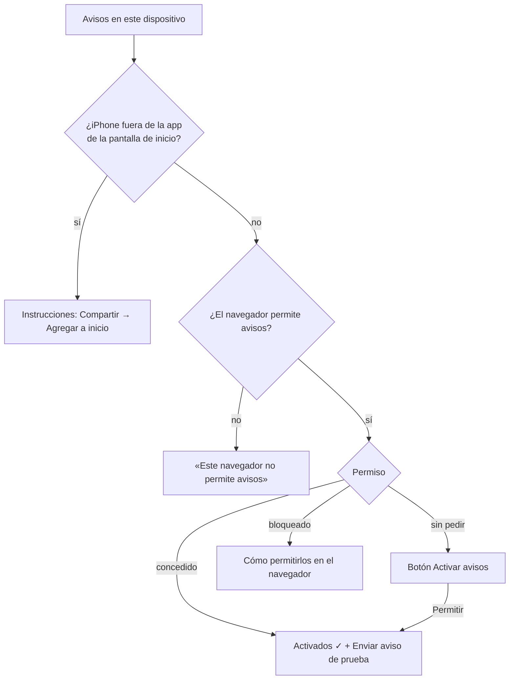
```mermaid
flowchart TD
  A["Avisos en este dispositivo"] --> I{"¿iPhone fuera de la app<br/>de la pantalla de inicio?"}
  I -- "sí" --> H["Instrucciones: Compartir → Agregar a inicio"]
  I -- "no" --> S{"¿El navegador permite avisos?"}
  S -- "no" --> U["«Este navegador no permite avisos»"]
  S -- "sí" --> P{"Permiso"}
  P -- "sin pedir" --> B["Botón Activar avisos"]
  P -- "bloqueado" --> D["Cómo permitirlos en el navegador"]
  P -- "concedido" --> G["Activados ✓ + Enviar aviso de prueba"]
  B -- "Permitir" --> G
```

Cuándo sale un aviso al celular:

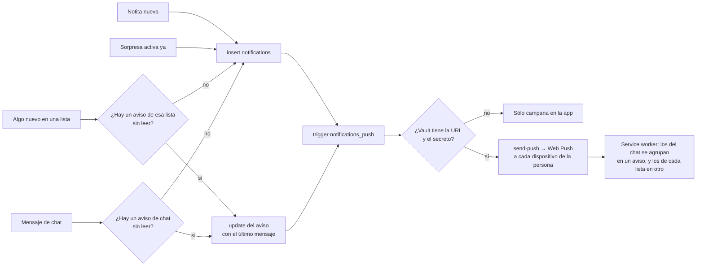
```mermaid
flowchart LR
  N["Notita nueva"] --> INS["insert notifications"]
  S["Sorpresa activa ya"] --> INS
  L["Algo nuevo en una lista"] --> QL{"¿Hay un aviso de esa lista<br/>sin leer?"}
  QL -- "no" --> INS
  QL -- "sí" --> UPD
  C["Mensaje de chat"] --> Q{"¿Hay un aviso de chat<br/>sin leer?"}
  Q -- "no" --> INS
  Q -- "sí" --> UPD["update del aviso<br/>con el último mensaje"]
  INS & UPD --> T["trigger notifications_push"]
  T --> V{"¿Vault tiene la URL<br/>y el secreto?"}
  V -- "no" --> X["Sólo campana en la app"]
  V -- "sí" --> SP["send-push → Web Push<br/>a cada dispositivo de la persona"]
  SP --> SW["Service worker: los del chat se agrupan<br/>en un aviso, y los de cada lista en otro"]
```

## Colores por persona

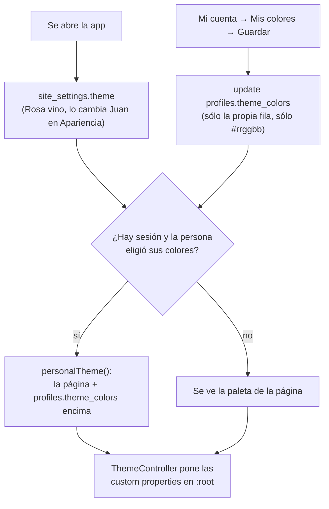
```mermaid
flowchart TD
  A["Se abre la app"] --> B["site_settings.theme<br/>(Rosa vino, lo cambia Juan en Apariencia)"]
  B --> C{"¿Hay sesión y la persona<br/>eligió sus colores?"}
  C -- "no" --> D["Se ve la paleta de la página"]
  C -- "sí" --> E["personalTheme():<br/>la página + profiles.theme_colors encima"]
  E --> F["ThemeController pone las<br/>custom properties en :root"]
  D --> F
  G["Mi cuenta → Mis colores → Guardar"] --> H["update profiles.theme_colors<br/>(sólo la propia fila, sólo #rrggbb)"]
  H --> C
```

## Perfil de cada persona

Qué se ve en el círculo de cada persona (cabecera, Mi cuenta, chat y listas):

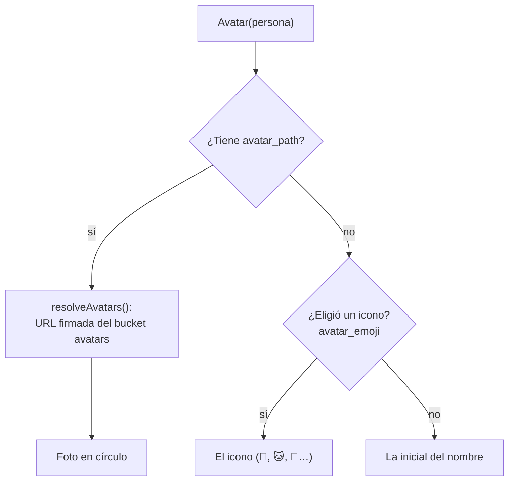
```mermaid
flowchart TD
  A["Avatar(persona)"] --> B{"¿Tiene avatar_path?"}
  B -- "sí" --> C["resolveAvatars():<br/>URL firmada del bucket avatars"]
  C --> F["Foto en círculo"]
  B -- "no" --> D{"¿Eligió un icono?<br/>avatar_emoji"}
  D -- "sí" --> E["El icono (🌻, 🐱, 🌙…)"]
  D -- "no" --> G["La inicial del nombre"]
```

Cambiar la foto en **Mi cuenta → Editar perfil**:

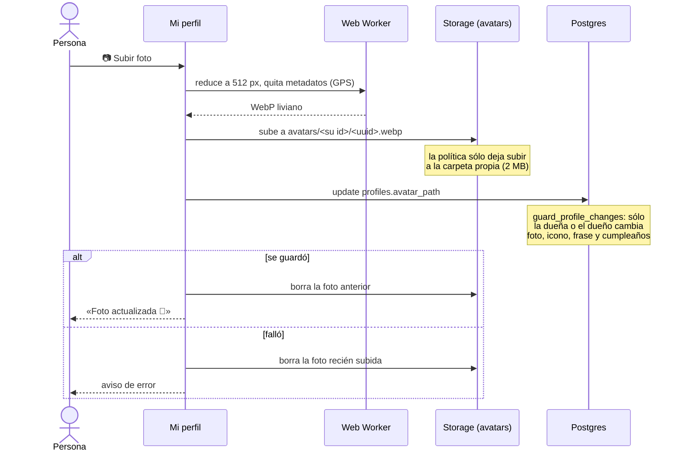
```mermaid
sequenceDiagram
  actor P as Persona
  participant App as Mi perfil
  participant W as Web Worker
  participant ST as Storage (avatars)
  participant DB as Postgres

  P->>App: 📷 Subir foto
  App->>W: reduce a 512 px, quita metadatos (GPS)
  W-->>App: WebP liviano
  App->>ST: sube a avatars/<su id>/<uuid>.webp
  Note over ST: la política sólo deja subir<br/>a la carpeta propia (2 MB)
  App->>DB: update profiles.avatar_path
  Note over DB: guard_profile_changes: sólo<br/>la dueña o el dueño cambia<br/>foto, icono, frase y cumpleaños
  alt se guardó
    App->>ST: borra la foto anterior
    App-->>P: «Foto actualizada 📸»
  else falló
    App->>ST: borra la foto recién subida
    App-->>P: aviso de error
  end
```

En el chat, tocar a la otra persona abre su tarjeta de perfil: foto en
grande, frase y cuenta regresiva a su cumpleaños (sólo día y mes).

## Listas compartidas

Crear una lista y trabajar en ella entre varias personas:

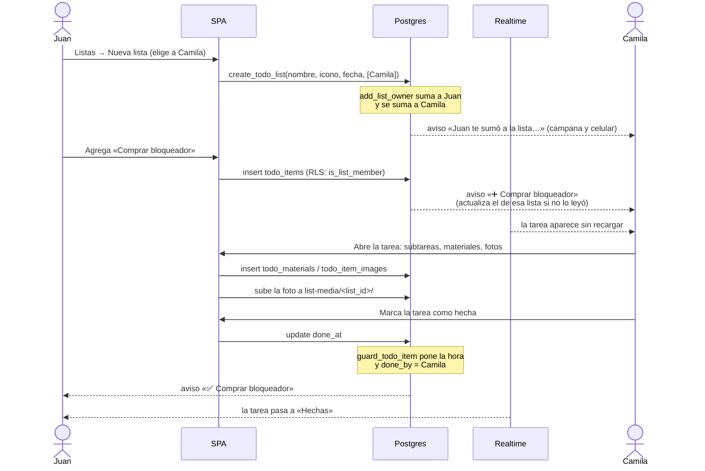
```mermaid
sequenceDiagram
  actor J as Juan
  participant App as SPA
  participant DB as Postgres
  participant RT as Realtime
  actor C as Camila

  J->>App: Listas → Nueva lista (elige a Camila)
  App->>DB: create_todo_list(nombre, icono, fecha, [Camila])
  Note over DB: add_list_owner suma a Juan<br/>y se suma a Camila
  DB-->>C: aviso «Juan te sumó a la lista…» (campana y celular)
  J->>App: Agrega «Comprar bloqueador»
  App->>DB: insert todo_items (RLS: is_list_member)
  DB-->>C: aviso «➕ Comprar bloqueador»<br/>(actualiza el de esa lista si no lo leyó)
  RT-->>C: la tarea aparece sin recargar
  C->>App: Abre la tarea: subtareas, materiales, fotos
  App->>DB: insert todo_materials / todo_item_images
  App->>DB: sube la foto a list-media/<list_id>/
  C->>App: Marca la tarea como hecha
  App->>DB: update done_at
  Note over DB: guard_todo_item pone la hora<br/>y done_by = Camila
  DB-->>J: aviso «✅ Comprar bloqueador»
  RT-->>J: la tarea pasa a «Hechas»
```

Qué puede hacer cada miembro:

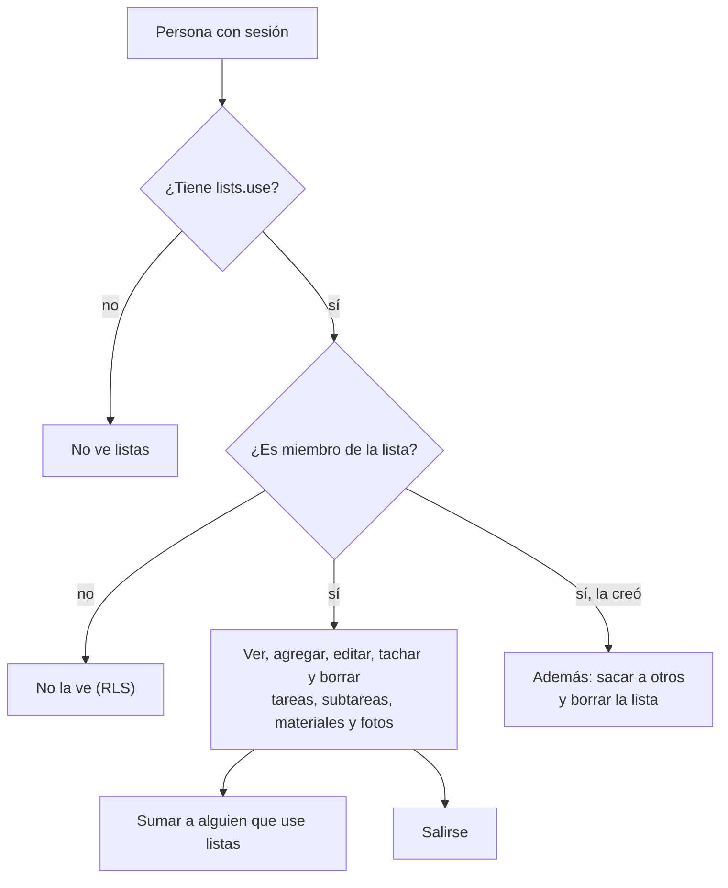
```mermaid
flowchart TD
  P["Persona con sesión"] --> U{"¿Tiene lists.use?"}
  U -- "no" --> N["No ve listas"]
  U -- "sí" --> M{"¿Es miembro de la lista?"}
  M -- "no" --> X["No la ve (RLS)"]
  M -- "sí" --> A["Ver, agregar, editar, tachar y borrar<br/>tareas, subtareas, materiales y fotos"]
  A --> S["Sumar a alguien que use listas"]
  A --> L["Salirse"]
  M -- "sí, la creó" --> O["Además: sacar a otros<br/>y borrar la lista"]
```

## Tutorial guiado

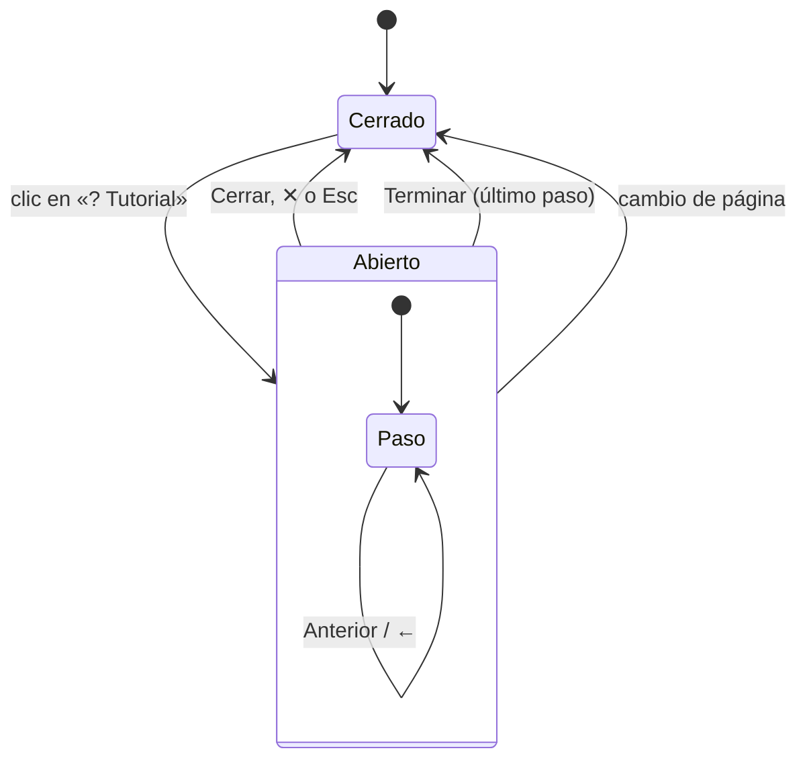
```mermaid
stateDiagram-v2
  [*] --> Cerrado
  Cerrado --> Abierto: clic en «? Tutorial»
  state Abierto {
    [*] --> Paso
    Paso --> Paso: Siguiente / →
    Paso --> Paso: Anterior / ←
  }
  Abierto --> Cerrado: Cerrar, ✕ o Esc
  Abierto --> Cerrado: Terminar (último paso)
  Abierto --> Cerrado: cambio de página
```

```mermaid
flowchart LR
  R["Ruta actual + AccessPolicy"] --> T["tourFor()<br/>pasos de la página + menú permitido"]
  T --> O{"¿Paso opcional<br/>sin destino?"}
  O -- "sí" --> SKIP["Se omite"]
  O -- "no" --> F["Primer destino visible<br/>data-tour o ☰ en móvil"]
  F --> L["tourLayout<br/>resaltado + posición de la tarjeta"]
```

## Integración y despliegue

```mermaid
flowchart LR
  DEV["Commit en una rama"] --> PR["Pull request"]
  PR --> CI["CI<br/>typecheck · lint · pruebas · build"]
  CI -- "verde" --> M["Merge a master"]
  M --> D1["Deploy: pruebas otra vez"]
  D1 --> D2["Migraciones en Supabase"]
  D2 --> D3["Configurar Auth<br/>URLs, registro cerrado, SMTP"]
  D3 --> D4["Publicar Edge Functions"]
  D4 --> D5["Configurar avisos push<br/>claves VAPID y secreto (sólo la 1.ª vez)<br/>en secretos de Supabase y Vault"]
  D5 --> REL["release.mjs<br/>SemVer desde los commits"]
  REL --> TAG["Tag vX.Y.Z + release con notas"]
  M --> NET["Netlify<br/>build con tags y publicación"]
  NET --> WEB["Sitio con la versión en el pie"]
```

## Modelo de datos

```mermaid
erDiagram
  AUTH_USERS ||--|| PROFILES : "tiene"
  PROFILES }o--|| ROLE : "rol"
  ROLE ||--o{ ROLE_PERMISSIONS : "concede"
  PERMISSIONS ||--o{ ROLE_PERMISSIONS : "en"
  PROFILES ||--o{ INVITATIONS : "crea"
  AUTH_USERS ||--o| INVITATIONS : "usa"
  AUTH_USERS ||--o{ NOTES : "envía / recibe"
  AUTH_USERS ||--o{ CHAT_MESSAGES : "escribe"
  AUTH_USERS ||--o| CHAT_READS : "conexión y vistos"
  CHAT_MESSAGES |o--o{ CHAT_MESSAGES : "responde a"
  AUTH_USERS ||--o{ NOTIFICATIONS : "recibe"
  AUTH_USERS ||--o{ PUSH_SUBSCRIPTIONS : "dispositivos"
  AUTH_USERS ||--o{ INTERRUPTION_VIEWS : "vio"
  INTERRUPTIONS ||--o{ INTERRUPTION_VIEWS : "vista por"
  PHOTOS ||--o{ MILESTONES : "ilustra"
  AUTH_USERS ||--o{ AUDIT_LOG : "actor"
  AUTH_USERS ||--o{ TODO_LISTS : "crea"
  TODO_LISTS ||--|{ TODO_LIST_MEMBERS : "se comparte con"
  AUTH_USERS ||--o{ TODO_LIST_MEMBERS : "es miembro"
  TODO_LISTS ||--o{ TODO_ITEMS : "tiene"
  TODO_ITEMS |o--o{ TODO_ITEMS : "subtarea de"
  TODO_ITEMS ||--o{ TODO_MATERIALS : "necesita"
  TODO_ITEMS ||--o{ TODO_ITEM_IMAGES : "fotos"

  PROFILES {
    uuid id PK
    text display_name
    app_role role
    boolean is_active
    jsonb theme_colors "colores propios"
    text avatar_path "avatars/<id>/..."
    text avatar_emoji
    text bio
    date birthday
  }
  PERMISSIONS {
    text key PK
    text description
  }
  ROLE_PERMISSIONS {
    app_role role PK
    text permission PK
  }
  INVITATIONS {
    uuid id PK
    text token_hash "SHA-256"
    app_role role "nunca super_admin"
    timestamptz expires_at
    timestamptz used_at
  }
  SITE_SETTINGS {
    smallint id PK "siempre 1"
    text site_title
    date relationship_start
    boolean is_public
    jsonb theme
  }
  SECTIONS {
    uuid id PK
    section_kind kind
    jsonb content
    int position
    boolean is_visible
  }
  PHOTOS {
    uuid id PK
    text storage_path
    text thumb_path
    date taken_on
    text source_hash "SHA-256"
  }
  MILESTONES {
    uuid id PK
    text title
    date happened_on
    uuid photo_id FK
  }
  IMPORTANT_DATES {
    uuid id PK
    text title
    date event_date
    boolean recurs_yearly
  }
  INTERRUPTIONS {
    uuid id PK
    text title
    interruption_style style
    timestamptz starts_at
    boolean is_active
    boolean show_once
  }
  NOTES {
    uuid id PK
    uuid sender_id FK
    uuid recipient_id FK
    note_kind kind
    timestamptz read_at
  }
  CHAT_MESSAGES {
    uuid id PK
    uuid sender_id FK
    chat_kind kind "text, image, sticker"
    text body
    uuid reply_to FK "mensaje citado"
    text image_path "chat-media/<user_id>/..."
    text thumb_path
    text sticker "id del catálogo"
  }
  CHAT_READS {
    uuid user_id PK
    timestamptz last_seen_at "última conexión"
    timestamptz last_read_at "hasta dónde leyó"
  }
  NOTIFICATIONS {
    uuid id PK
    uuid user_id FK
    text kind "note, chat, system, list"
    text title
    text body
    text link
    timestamptz read_at
  }
  PUSH_SUBSCRIPTIONS {
    uuid id PK
    uuid user_id FK
    text endpoint UK "un dispositivo"
    text p256dh
    text auth
  }
  TODO_LISTS {
    uuid id PK
    uuid owner_id FK "quien la creó"
    text title
    text emoji
    text description
    date due_on
  }
  TODO_LIST_MEMBERS {
    uuid list_id PK
    uuid user_id PK
    uuid added_by FK
  }
  TODO_ITEMS {
    uuid id PK
    uuid list_id FK
    uuid parent_id FK "subtarea (un nivel)"
    text title
    text description
    date due_on
    uuid assignee_id FK "miembro"
    timestamptz done_at
    uuid done_by FK
  }
  TODO_MATERIALS {
    uuid id PK
    uuid item_id FK
    text name
    text quantity
    boolean is_ready
  }
  TODO_ITEM_IMAGES {
    uuid id PK
    uuid item_id FK
    uuid list_id FK
    text path "list-media/<list_id>/..."
    text thumb_path
  }
  AUDIT_LOG {
    bigint id PK
    uuid actor_id FK
    text action
    text table_name
    jsonb old_data
    jsonb new_data
  }
```

`ROLE` representa el tipo enumerado `app_role` (`super_admin`, `editor`,
`viewer`), no una tabla. `SITE_SETTINGS`, `SECTIONS` e `IMPORTANT_DATES` no
tienen relaciones fuertes: los lee cualquiera con `site.view`.

## Roles y permisos

```mermaid
flowchart LR
  subgraph super_admin["super_admin (Juan)"]
    ALL["todos los permisos"]
  end
  subgraph editor["editor (Camila)"]
    E1["site.view"]
    E2["content.edit"]
    E3["photos.manage"]
    E4["dates.manage"]
    E5["interruptions.manage"]
    E6["notes.send"]
    E7["chat.use"]
    E8["lists.use"]
  end
  subgraph viewer["viewer (invitado)"]
    V1["site.view"]
    V2["notes.send"]
    V3["chat.use"]
    V4["lists.use"]
  end
  ALL --> SUPER["/super: usuarios, permisos,<br/>apariencia, secciones, ajustes, auditoría"]
  E2 & E3 & E4 & E5 --> PANEL["/panel"]
  E6 & V2 --> MSG["/mensajes"]
  E7 & V3 --> CHAT["/chat"]
  E8 & V4 --> LISTAS["/listas<br/>(dentro, sólo las listas<br/>donde es miembro)"]
  ANY["cualquier cuenta"] --> CUENTA["/cuenta, /cuenta/perfil y /cuenta/colores<br/>perfil, avisos, colores, contraseña"]
```

Estos son los permisos por defecto (migración `core_schema`). Juan los cambia
en **Administración → Roles y permisos** y la base de datos los aplica al
instante.
