# Diagramas

Diagramas de la app en [Mermaid](https://mermaid.js.org/). GitHub los dibuja
directamente al abrir este archivo. La explicación de cada pieza está en
[ARQUITECTURA.md](ARQUITECTURA.md).

- [Arquitectura general](#arquitectura-general)
- [Capas del frontend](#capas-del-frontend)
- [Navegación y permisos](#navegación-y-permisos)
  - [Mi cuenta](#mi-cuenta)
- [Inicio de sesión](#inicio-de-sesión)
  - [Verificación en dos pasos](#verificación-en-dos-pasos)
- [Invitación por enlace o QR](#invitación-por-enlace-o-qr)
- [Recuperación de contraseña](#recuperación-de-contraseña)
- [Subida de fotos](#subida-de-fotos)
  - [Orden de las fotos en un mes](#orden-de-las-fotos-en-un-mes)
  - [Carga rápida de las fotos](#carga-rápida-de-las-fotos)
- [Notitas, chat y notificaciones](#notitas-chat-y-notificaciones)
- [App de chat](#app-de-chat)
- [Chat: respuestas, conexión y vistos](#chat-respuestas-conexión-y-vistos)
- [Chat: fotos y stickers](#chat-fotos-y-stickers)
- [Avisos en el celular](#avisos-en-el-celular)
- [App de celular](#app-de-celular)
- [Sorpresas para una persona](#sorpresas-para-una-persona)
- [Colores por persona](#colores-por-persona)
- [Temas de fechas especiales](#temas-de-fechas-especiales)
- [Fin de la relación](#fin-de-la-relación)
- [Perfil de cada persona](#perfil-de-cada-persona)
- [Listas compartidas](#listas-compartidas)
- [Dedicatorias y playlist](#dedicatorias-y-playlist)
- [Tutorial guiado](#tutorial-guiado)
  - [Novedades de cada versión](#novedades-de-cada-versión)
- [Idiomas](#idiomas)
- [Capas de seguridad](#capas-de-seguridad)
- [Integración y despliegue](#integración-y-despliegue)
- [Modelo de datos](#modelo-de-datos)
- [Roles y permisos](#roles-y-permisos)
- [Auditoría: filtros y páginas](#auditoría-filtros-y-páginas)
- [Legal y privacidad](#legal-y-privacidad)

## Arquitectura general

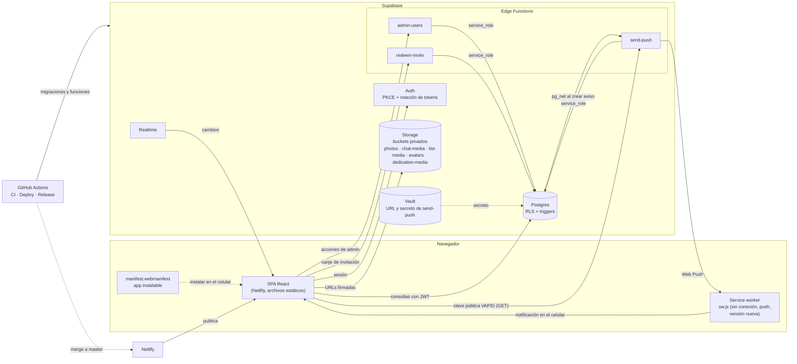
```mermaid
flowchart LR
  subgraph Navegador
    SPA["SPA React<br/>(Netlify, archivos estáticos)"]
    SW["Service worker<br/>sw.js (sin conexión, push,<br/>versión nueva)"]
    MF["manifest.webmanifest<br/>app instalable"]
  end
  subgraph Supabase
    AUTH["Auth<br/>PKCE + rotación de tokens"]
    DB[("Postgres<br/>RLS + triggers")]
    ST[("Storage<br/>buckets privados<br/>photos · chat-media · list-media · avatars · dedication-media")]
    RT["Realtime"]
    VA[("Vault<br/>URL y secreto de send-push")]
    subgraph Edge["Edge Functions"]
      AU["admin-users"]
      RI["redeem-invite"]
      SP["send-push"]
    end
  end
  GH["GitHub Actions<br/>CI · Deploy · Release"]
  NL["Netlify"]

  MF -. "instalar en el celular" .-> SPA
  SPA -- "sesión" --> AUTH
  SPA -- "consultas con JWT" --> DB
  SPA -- "URLs firmadas" --> ST
  RT -- "cambios" --> SPA
  SPA -- "acciones de admin" --> AU
  SPA -- "canje de invitación" --> RI
  DB -- "pg_net al crear aviso" --> SP
  VA -. "secreto" .-> DB
  SPA -- "clave pública VAPID (GET)" --> SP
  SP -- "Web Push" --> SW
  SW -- "notificación en el celular" --> SPA
  AU & RI & SP -- "service_role" --> DB
  GH -- "migraciones y funciones" --> Supabase
  GH -. "merge a master" .-> NL
  NL -- "publica" --> SPA
```

## Capas del frontend

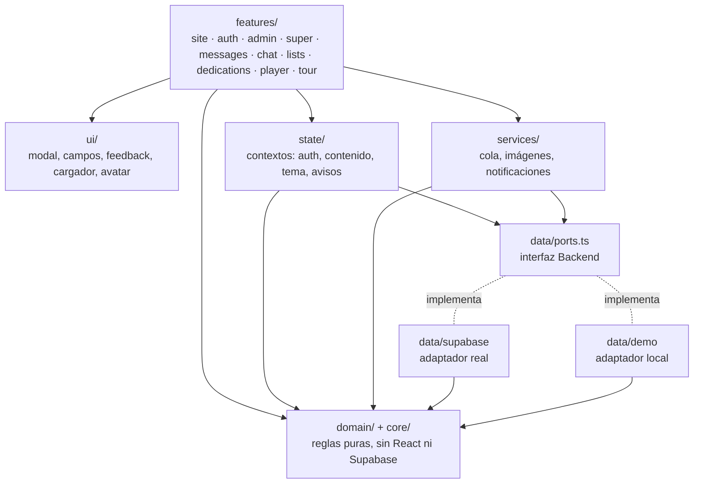
```mermaid
flowchart TB
  F["features/<br/>site · auth · admin · super · messages · chat · lists · dedications · player · tour"]
  UI["ui/<br/>modal, campos, feedback, cargador, avatar"]
  S["state/<br/>contextos: auth, contenido, tema, avisos"]
  SV["services/<br/>cola, imágenes, notificaciones"]
  P["data/ports.ts<br/>interfaz Backend"]
  A1["data/supabase<br/>adaptador real"]
  A2["data/demo<br/>adaptador local"]
  D["domain/ + core/<br/>reglas puras, sin React ni Supabase"]

  F --> UI & S & SV & D
  S --> P
  SV --> P
  P -. "implementa" .- A1
  P -. "implementa" .- A2
  S & SV & A1 & A2 --> D
```

## Navegación y permisos

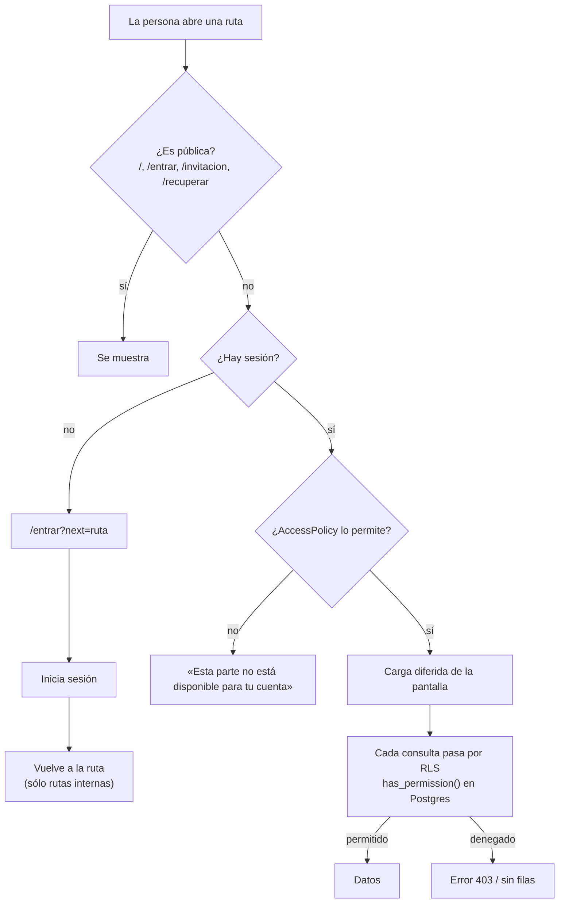
```mermaid
flowchart TD
  A["La persona abre una ruta"] --> B{"¿Es pública?<br/>/, /entrar, /invitacion, /recuperar"}
  B -- "sí" --> P["Se muestra"]
  B -- "no" --> C{"¿Hay sesión?"}
  C -- "no" --> L["/entrar?next=ruta"]
  L --> LG["Inicia sesión"] --> R["Vuelve a la ruta<br/>(sólo rutas internas)"]
  C -- "sí" --> D{"¿AccessPolicy lo permite?"}
  D -- "no" --> E["«Esta parte no está disponible para tu cuenta»"]
  D -- "sí" --> F["Carga diferida de la pantalla"]
  F --> G["Cada consulta pasa por RLS<br/>has_permission() en Postgres"]
  G -- "permitido" --> OK["Datos"]
  G -- "denegado" --> X["Error 403 / sin filas"]
```

### Mi cuenta

Las opciones van en un menú a la izquierda y la elegida se abre en el centro;
en el celular el menú pasa a una fila de pestañas arriba (la abierta se centra
sola). Cada opción tiene su dirección, así funcionan «atrás» y los enlaces.

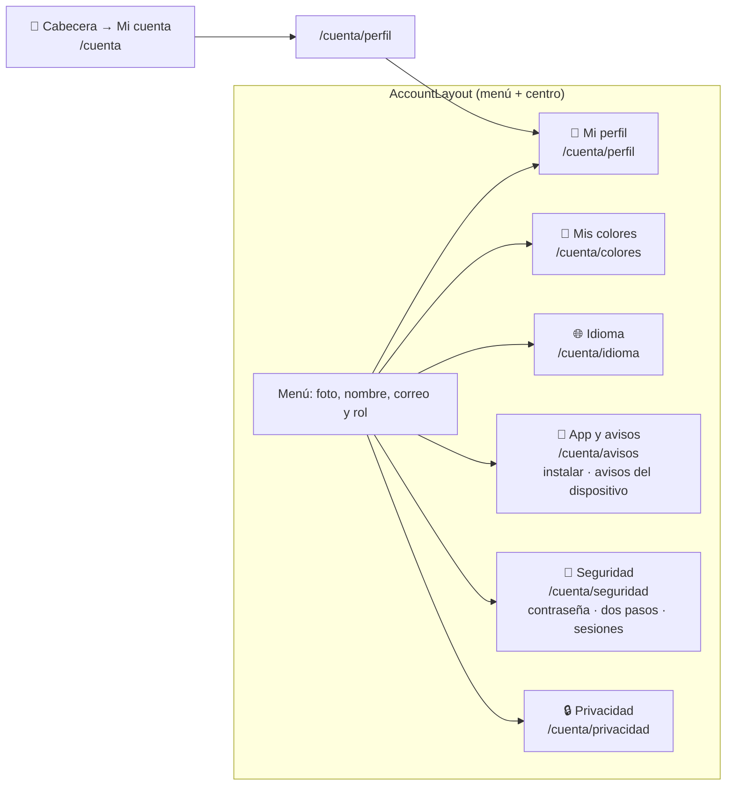
```mermaid
flowchart LR
  H["👤 Cabecera → Mi cuenta<br/>/cuenta"] --> R["/cuenta/perfil"]
  subgraph L["AccountLayout (menú + centro)"]
    direction TB
    M["Menú: foto, nombre, correo y rol"]
    M --> P["👤 Mi perfil<br/>/cuenta/perfil"]
    M --> C["🎨 Mis colores<br/>/cuenta/colores"]
    M --> I["🌐 Idioma<br/>/cuenta/idioma"]
    M --> A["🔔 App y avisos<br/>/cuenta/avisos<br/>instalar · avisos del dispositivo"]
    M --> S["🔐 Seguridad<br/>/cuenta/seguridad<br/>contraseña · dos pasos · sesiones"]
    M --> V["🔒 Privacidad<br/>/cuenta/privacidad"]
  end
  R --> P
```

## Inicio de sesión

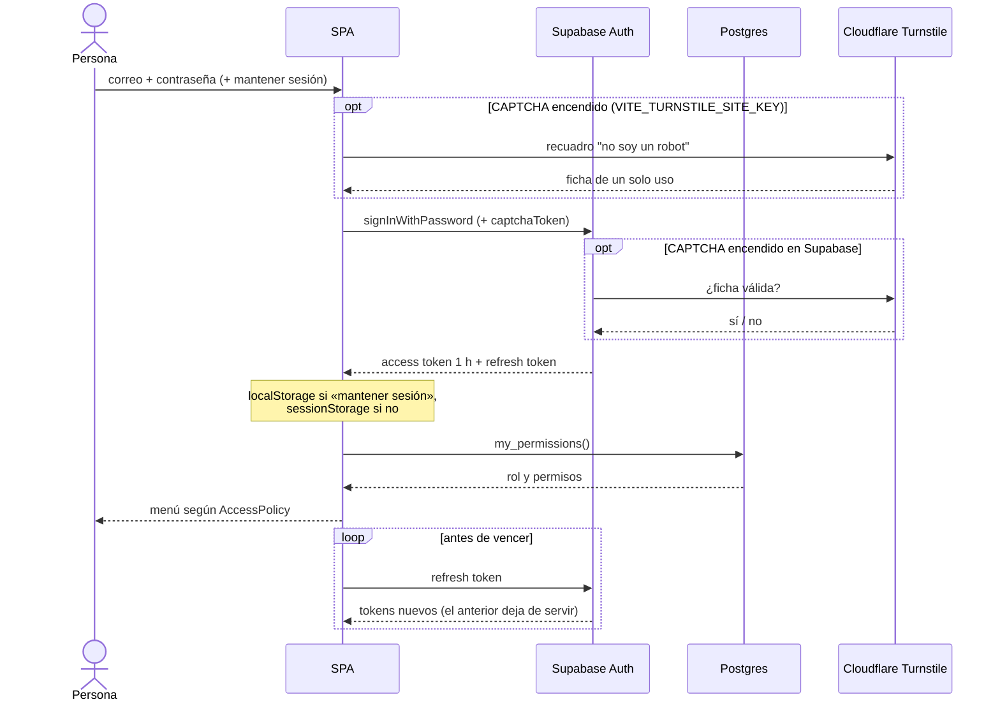
```mermaid
sequenceDiagram
  actor U as Persona
  participant App as SPA
  participant Auth as Supabase Auth
  participant DB as Postgres

  participant CF as Cloudflare Turnstile

  U->>App: correo + contraseña (+ mantener sesión)
  opt CAPTCHA encendido (VITE_TURNSTILE_SITE_KEY)
    App->>CF: recuadro "no soy un robot"
    CF-->>App: ficha de un solo uso
  end
  App->>Auth: signInWithPassword (+ captchaToken)
  opt CAPTCHA encendido en Supabase
    Auth->>CF: ¿ficha válida?
    CF-->>Auth: sí / no
  end
  Auth-->>App: access token 1 h + refresh token
  Note over App: localStorage si «mantener sesión»,<br/>sessionStorage si no
  App->>DB: my_permissions()
  DB-->>App: rol y permisos
  App-->>U: menú según AccessPolicy
  loop antes de vencer
    App->>Auth: refresh token
    Auth-->>App: tokens nuevos (el anterior deja de servir)
  end
```

### Verificación en dos pasos

Opcional: cada persona la activa o la quita en **Mi cuenta**. Quien no la
activa entra como siempre.

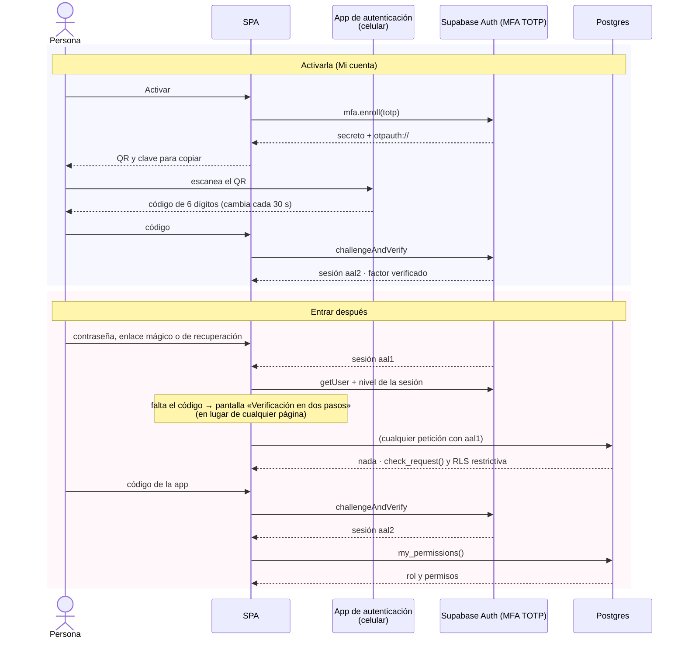
```mermaid
sequenceDiagram
  actor U as Persona
  participant App as SPA
  participant App2 as App de autenticación<br/>(celular)
  participant Auth as Supabase Auth (MFA TOTP)
  participant DB as Postgres

  rect rgba(200, 200, 255, 0.15)
  Note over U,DB: Activarla (Mi cuenta)
  U->>App: Activar
  App->>Auth: mfa.enroll(totp)
  Auth-->>App: secreto + otpauth://
  App-->>U: QR y clave para copiar
  U->>App2: escanea el QR
  App2-->>U: código de 6 dígitos (cambia cada 30 s)
  U->>App: código
  App->>Auth: challengeAndVerify
  Auth-->>App: sesión aal2 · factor verificado
  end

  rect rgba(255, 200, 220, 0.15)
  Note over U,DB: Entrar después
  U->>App: contraseña, enlace mágico o de recuperación
  Auth-->>App: sesión aal1
  App->>Auth: getUser + nivel de la sesión
  Note over App: falta el código → pantalla «Verificación en dos pasos»<br/>(en lugar de cualquier página)
  App->>DB: (cualquier petición con aal1)
  DB-->>App: nada · check_request() y RLS restrictiva
  U->>App: código de la app
  App->>Auth: challengeAndVerify
  Auth-->>App: sesión aal2
  App->>DB: my_permissions()
  DB-->>App: rol y permisos
  end
```

Cómo la base de datos hace cumplir el segundo paso, aunque alguien tenga la
contraseña y llame a la API directamente:

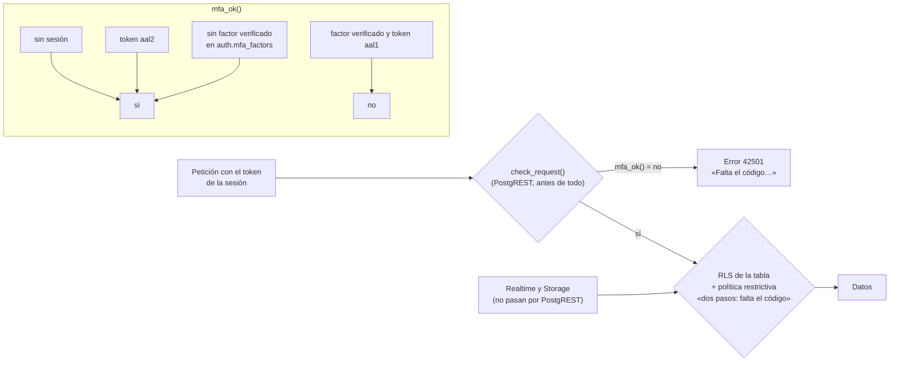
```mermaid
flowchart LR
  REQ["Petición con el token<br/>de la sesión"] --> PRE{"check_request()<br/>(PostgREST, antes de todo)"}
  PRE -- "mfa_ok() = no" --> NO["Error 42501<br/>«Falta el código…»"]
  PRE -- "sí" --> RLS{"RLS de la tabla<br/>+ política restrictiva<br/>«dos pasos: falta el código»"}
  RLS --> OK["Datos"]
  RT["Realtime y Storage<br/>(no pasan por PostgREST)"] --> RLS
  subgraph mfa_ok["mfa_ok()"]
    A["sin sesión"] --> Y["sí"]
    B["token aal2"] --> Y
    C["sin factor verificado<br/>en auth.mfa_factors"] --> Y
    D["factor verificado y token aal1"] --> N["no"]
  end
```

Si alguien pierde el celular, quien gestiona cuentas pulsa 📵 en
**Super → Usuarios**: `admin-users` (`reset_two_step`) borra sus factores con
la service role, queda en la auditoría y la persona vuelve a entrar sólo con su
contraseña.

## Invitación por enlace o QR

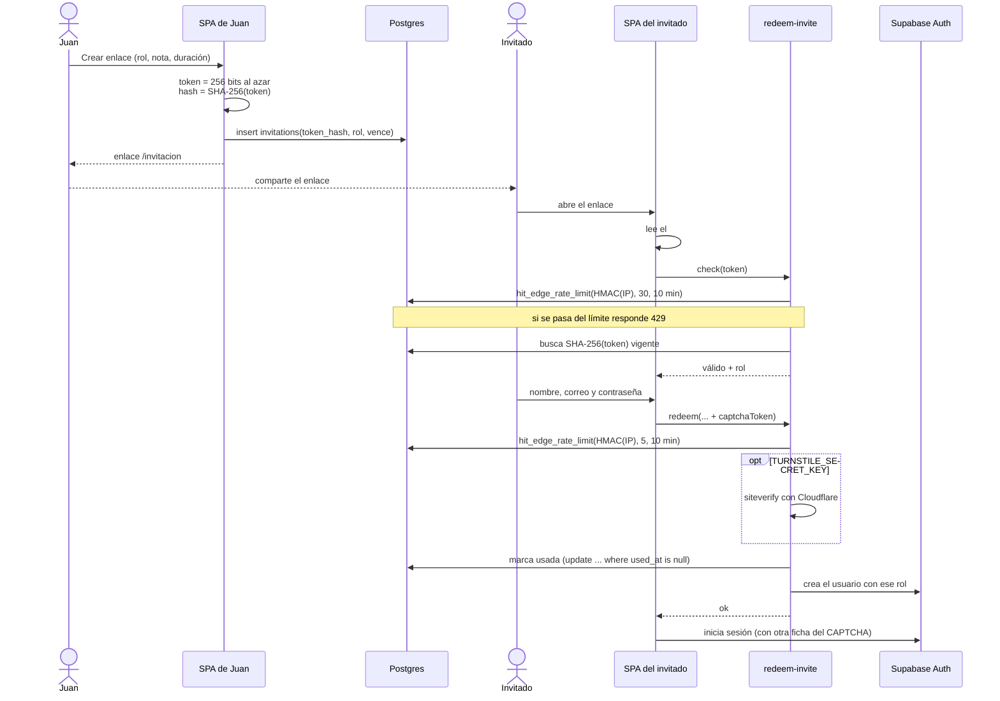
```mermaid
sequenceDiagram
  actor J as Juan
  participant App as SPA de Juan
  participant DB as Postgres
  actor I as Invitado
  participant App2 as SPA del invitado
  participant RI as redeem-invite
  participant Auth as Supabase Auth

  J->>App: Crear enlace (rol, nota, duración)
  App->>App: token = 256 bits al azar<br/>hash = SHA-256(token)
  App->>DB: insert invitations(token_hash, rol, vence)
  App-->>J: enlace /invitacion#token y QR
  J-->>I: comparte el enlace
  I->>App2: abre el enlace
  App2->>App2: lee el #fragmento y lo borra de la barra
  App2->>RI: check(token)
  RI->>DB: hit_edge_rate_limit(HMAC(IP), 30, 10 min)
  Note over RI,DB: si se pasa del límite responde 429
  RI->>DB: busca SHA-256(token) vigente
  RI-->>App2: válido + rol
  I->>App2: nombre, correo y contraseña
  App2->>RI: redeem(... + captchaToken)
  RI->>DB: hit_edge_rate_limit(HMAC(IP), 5, 10 min)
  opt TURNSTILE_SECRET_KEY
    RI->>RI: siteverify con Cloudflare
  end
  RI->>DB: marca usada (update ... where used_at is null)
  RI->>Auth: crea el usuario con ese rol
  RI-->>App2: ok
  App2->>Auth: inicia sesión (con otra ficha del CAPTCHA)
```

## Recuperación de contraseña

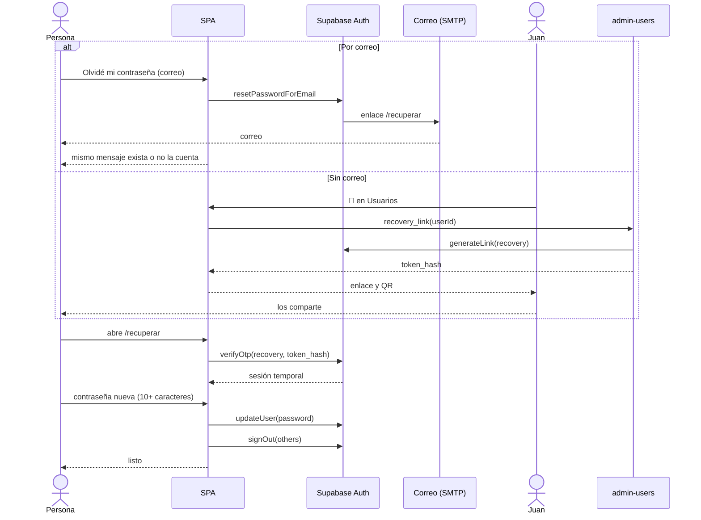
```mermaid
sequenceDiagram
  actor U as Persona
  participant App as SPA
  participant Auth as Supabase Auth
  participant Mail as Correo (SMTP)
  actor J as Juan
  participant AU as admin-users

  alt Por correo
    U->>App: Olvidé mi contraseña (correo)
    App->>Auth: resetPasswordForEmail
    Auth->>Mail: enlace /recuperar#token_hash
    Mail-->>U: correo
    App-->>U: mismo mensaje exista o no la cuenta
  else Sin correo
    J->>App: 🔑 en Usuarios
    App->>AU: recovery_link(userId)
    AU->>Auth: generateLink(recovery)
    AU-->>App: token_hash
    App-->>J: enlace y QR
    J-->>U: los comparte
  end
  U->>App: abre /recuperar#token_hash
  App->>Auth: verifyOtp(recovery, token_hash)
  Auth-->>App: sesión temporal
  U->>App: contraseña nueva (10+ caracteres)
  App->>Auth: updateUser(password)
  App->>Auth: signOut(others)
  App-->>U: listo
```

## Subida de fotos

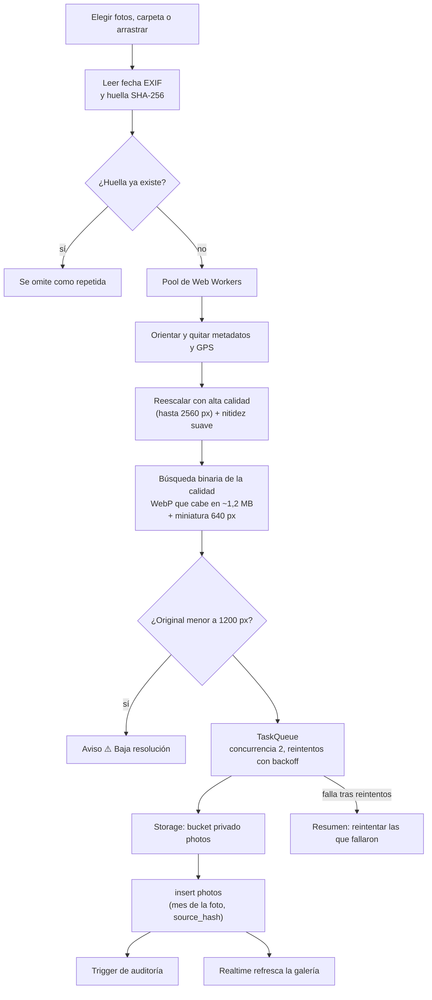
```mermaid
flowchart TD
  A["Elegir fotos, carpeta o arrastrar"] --> B["Leer fecha EXIF<br/>y huella SHA-256"]
  B --> C{"¿Huella ya existe?"}
  C -- "sí" --> SKIP["Se omite como repetida"]
  C -- "no" --> D["Pool de Web Workers"]
  D --> E["Orientar y quitar metadatos y GPS"]
  E --> S["Reescalar con alta calidad<br/>(hasta 2560 px) + nitidez suave"]
  S --> BQ["Búsqueda binaria de la calidad<br/>WebP que cabe en ~1,2 MB<br/>+ miniatura 640 px"]
  BQ --> LR{"¿Original menor a 1200 px?"}
  LR -- "sí" --> W["Aviso ⚠️ Baja resolución"]
  LR --> Q["TaskQueue<br/>concurrencia 2, reintentos con backoff"]
  Q --> U["Storage: bucket privado photos"]
  U --> R["insert photos<br/>(mes de la foto, source_hash)"]
  R --> T["Trigger de auditoría"]
  R --> RT["Realtime refresca la galería"]
  Q -- "falla tras reintentos" --> F["Resumen: reintentar las que fallaron"]
```

### Cambiar una foto

Si una foto se subió mal o se ve borrosa, se cambia el archivo sin tocar su
mensaje, su fecha ni su lugar (álbum del panel y dedicatorias).

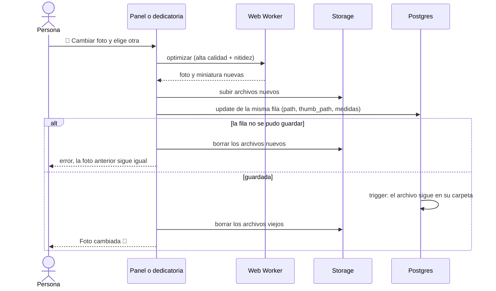
```mermaid
sequenceDiagram
  actor P as Persona
  participant UI as Panel o dedicatoria
  participant W as Web Worker
  participant S as Storage
  participant DB as Postgres
  P->>UI: 🔄 Cambiar foto y elige otra
  UI->>W: optimizar (alta calidad + nitidez)
  W-->>UI: foto y miniatura nuevas
  UI->>S: subir archivos nuevos
  UI->>DB: update de la misma fila (path, thumb_path, medidas)
  alt la fila no se pudo guardar
    UI->>S: borrar los archivos nuevos
    UI-->>P: error, la foto anterior sigue igual
  else guardada
    DB->>DB: trigger: el archivo sigue en su carpeta
    UI->>S: borrar los archivos viejos
    UI-->>P: Foto cambiada 💖
  end
```

### Orden de las fotos en un mes

La fecha sólo decide en qué mes cae la foto. Dentro del mes manda el orden que
se elige en **Mi panel → Fotos** con ↑ ↓ o arrastrando; si dos fotos tienen la
misma posición, va primero la del día anterior.

El nuevo orden se pinta enseguida desde el store (`reorderPhotos`). Si se
toca ↑ ↓ varias veces seguidas, los guardados van uno detrás de otro y la
lista no se recarga del servidor hasta que termina el último: así una
respuesta vieja nunca devuelve la foto a su sitio por un momento.

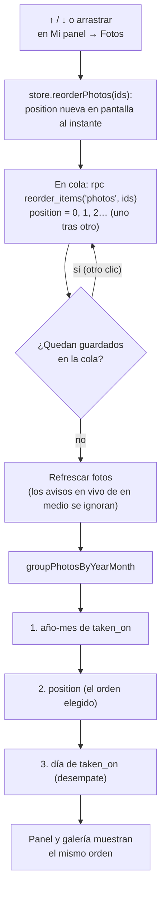
```mermaid
flowchart TD
  A["↑ / ↓ o arrastrar<br/>en Mi panel → Fotos"] --> B["store.reorderPhotos(ids):<br/>position nueva en pantalla al instante"]
  B --> C["En cola: rpc reorder_items('photos', ids)<br/>position = 0, 1, 2… (uno tras otro)"]
  C --> W{"¿Quedan guardados<br/>en la cola?"}
  W -- "sí (otro clic)" --> C
  W -- "no" --> D["Refrescar fotos<br/>(los avisos en vivo de en medio se ignoran)"]
  D --> E["groupPhotosByYearMonth"]
  E --> F["1. año-mes de taken_on"]
  F --> G["2. position (el orden elegido)"]
  G --> H["3. día de taken_on (desempate)"]
  H --> I["Panel y galería muestran<br/>el mismo orden"]
```

### Carga rápida de las fotos

Las fotos viven en un bucket privado y se piden con URLs firmadas que cambian
cada hora. Para que no haya que esperar a la red:

- El service worker guarda cada foto **por ruta** (sin el token). La foto se
  entrega mientras llega y se guarda en segundo plano; el recorte a 600 fotos
  se hace una sola vez al final de cada ráfaga.
- Al abrir la app se pintan las fotos con las URLs que ya están en el
  dispositivo, aunque estén vencidas (se guardan 14 días): el service worker
  las sirve de su caché. Mientras, se firman las nuevas en una sola petición
  (sin repetirla si el arranque y la recarga la piden a la vez).
- En el visor se ve al instante la miniatura (desenfocada y del tamaño final)
  y se cambia por la foto grande cuando termina de bajar. La anterior y la
  siguiente se precargan, y la primera de cada mes se pide al pasar el ratón
  o el dedo por la tarjeta del mes.

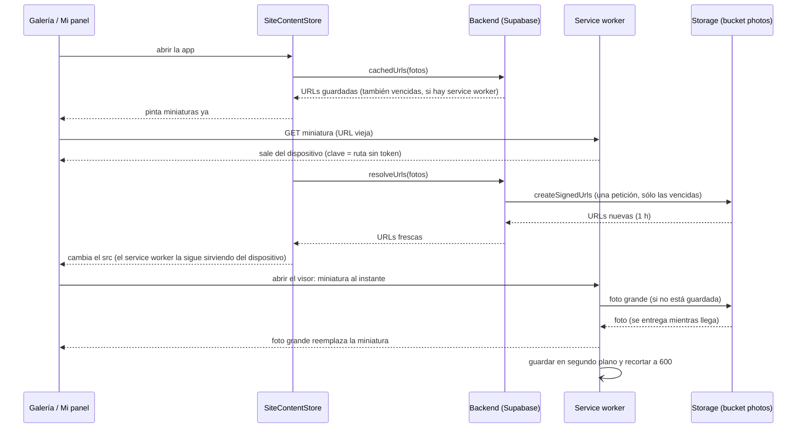
```mermaid
sequenceDiagram
  participant G as Galería / Mi panel
  participant S as SiteContentStore
  participant B as Backend (Supabase)
  participant SW as Service worker
  participant ST as Storage (bucket photos)
  G->>S: abrir la app
  S->>B: cachedUrls(fotos)
  B-->>S: URLs guardadas (también vencidas, si hay service worker)
  S-->>G: pinta miniaturas ya
  G->>SW: GET miniatura (URL vieja)
  SW-->>G: sale del dispositivo (clave = ruta sin token)
  S->>B: resolveUrls(fotos)
  B->>ST: createSignedUrls (una petición, sólo las vencidas)
  ST-->>B: URLs nuevas (1 h)
  B-->>S: URLs frescas
  S-->>G: cambia el src (el service worker la sigue sirviendo del dispositivo)
  G->>SW: abrir el visor: miniatura al instante
  SW->>ST: foto grande (si no está guardada)
  ST-->>SW: foto (se entrega mientras llega)
  SW-->>G: foto grande reemplaza la miniatura
  SW-)SW: guardar en segundo plano y recortar a 600
```

## Notitas, chat y notificaciones

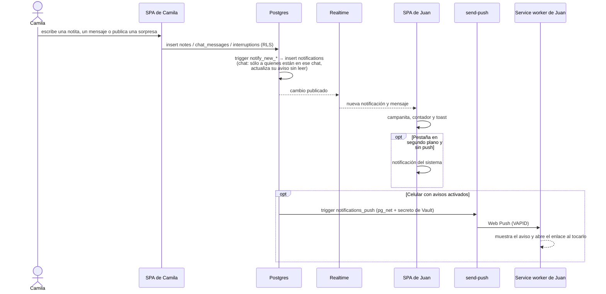
```mermaid
sequenceDiagram
  actor C as Camila
  participant A as SPA de Camila
  participant DB as Postgres
  participant RT as Realtime
  participant B as SPA de Juan
  participant SP as send-push
  participant SW as Service worker de Juan

  C->>A: escribe una notita, un mensaje o publica una sorpresa
  A->>DB: insert notes / chat_messages / interruptions (RLS)
  DB->>DB: trigger notify_new_* → insert notifications<br/>(chat: sólo a quienes están en ese chat,<br/>actualiza su aviso sin leer)
  DB-->>RT: cambio publicado
  RT-->>B: nueva notificación y mensaje
  B->>B: campanita, contador y toast
  opt Pestaña en segundo plano y sin push
    B->>B: notificación del sistema
  end
  opt Celular con avisos activados
    DB->>SP: trigger notifications_push (pg_net + secreto de Vault)
    SP->>SW: Web Push (VAPID)
    SW-->>SW: muestra el aviso y abre el enlace al tocarlo
  end
```

## App de chat

Pantallas de `/chat`. En el computador se ven la bandeja y la conversación
lado a lado; en el celular, una a la vez (y dentro de un chat se esconde la
cabecera del sitio).

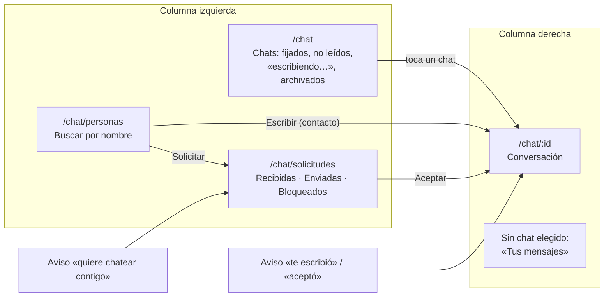
```mermaid
flowchart LR
  subgraph Bandeja["Columna izquierda"]
    L["/chat<br/>Chats: fijados, no leídos,<br/>«escribiendo…», archivados"]
    R["/chat/solicitudes<br/>Recibidas · Enviadas · Bloqueados"]
    P["/chat/personas<br/>Buscar por nombre"]
  end
  subgraph Conversacion["Columna derecha"]
    V["/chat/:id<br/>Conversación"]
    E["Sin chat elegido:<br/>«Tus mensajes»"]
  end
  L -- "toca un chat" --> V
  P -- "Solicitar" --> R
  P -- "Escribir (contacto)" --> V
  R -- "Aceptar" --> V
  N["Aviso «quiere chatear contigo»"] --> R
  M["Aviso «te escribió» / «aceptó»"] --> V
```

### Solicitudes de contacto

Para chatear hay que aceptarse. Todo pasa por funciones de la base que usan
la sesión (`auth.uid()`); nadie crea contactos ni conversaciones a mano.

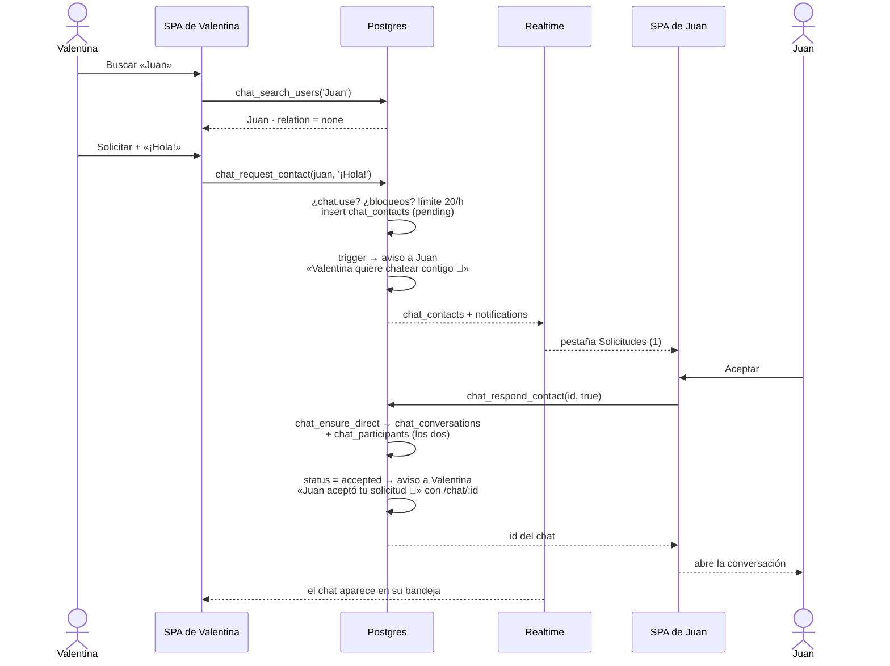
```mermaid
sequenceDiagram
  actor V as Valentina
  participant A as SPA de Valentina
  participant DB as Postgres
  participant RT as Realtime
  participant B as SPA de Juan
  actor J as Juan

  V->>A: Buscar «Juan»
  A->>DB: chat_search_users('Juan')
  DB-->>A: Juan · relation = none
  V->>A: Solicitar + «¡Hola!»
  A->>DB: chat_request_contact(juan, '¡Hola!')
  DB->>DB: ¿chat.use? ¿bloqueos? límite 20/h<br/>insert chat_contacts (pending)
  DB->>DB: trigger → aviso a Juan<br/>«Valentina quiere chatear contigo 👋»
  DB-->>RT: chat_contacts + notifications
  RT-->>B: pestaña Solicitudes (1)
  J->>B: Aceptar
  B->>DB: chat_respond_contact(id, true)
  DB->>DB: chat_ensure_direct → chat_conversations<br/>+ chat_participants (los dos)
  DB->>DB: status = accepted → aviso a Valentina<br/>«Juan aceptó tu solicitud 🎉» con /chat/:id
  DB-->>B: id del chat
  B-->>J: abre la conversación
  RT-->>A: el chat aparece en su bandeja
```

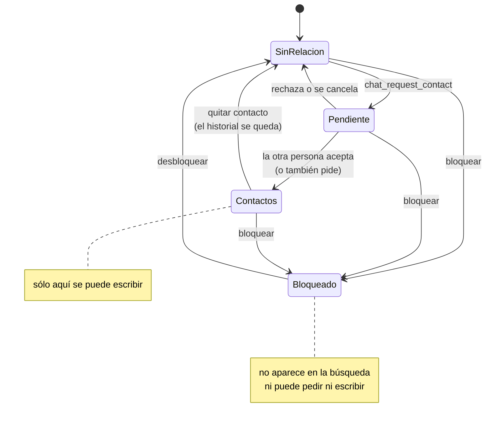
```mermaid
stateDiagram-v2
  [*] --> SinRelacion
  SinRelacion --> Pendiente: chat_request_contact
  Pendiente --> Contactos: la otra persona acepta<br/>(o también pide)
  Pendiente --> SinRelacion: rechaza o se cancela
  Contactos --> SinRelacion: quitar contacto<br/>(el historial se queda)
  SinRelacion --> Bloqueado: bloquear
  Pendiente --> Bloqueado: bloquear
  Contactos --> Bloqueado: bloquear
  Bloqueado --> SinRelacion: desbloquear
  note right of Contactos: sólo aquí se puede escribir
  note right of Bloqueado: no aparece en la búsqueda<br/>ni puede pedir ni escribir
```

### Quién lee y quién escribe

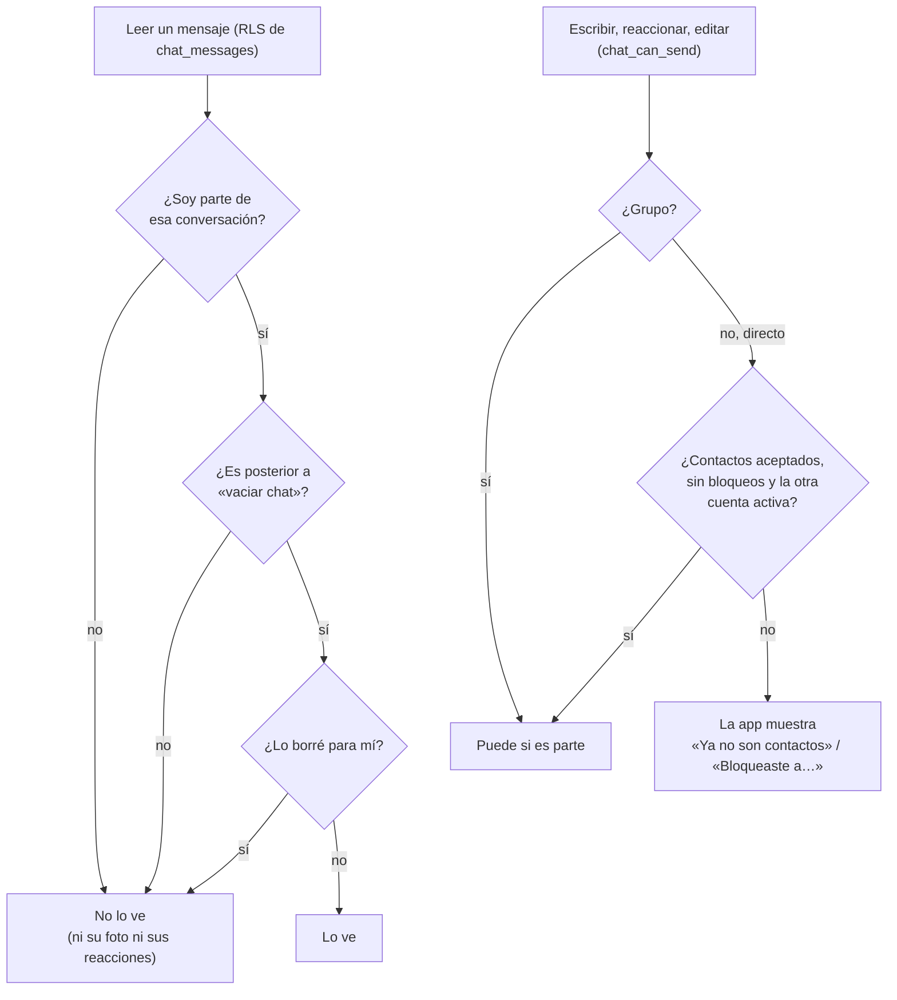
```mermaid
flowchart TD
  Q["Leer un mensaje (RLS de chat_messages)"] --> P1{"¿Soy parte de<br/>esa conversación?"}
  P1 -- "no" --> NO1["No lo ve<br/>(ni su foto ni sus reacciones)"]
  P1 -- "sí" --> P2{"¿Es posterior a<br/>«vaciar chat»?"}
  P2 -- "no" --> NO1
  P2 -- "sí" --> P3{"¿Lo borré para mí?"}
  P3 -- "sí" --> NO1
  P3 -- "no" --> SI1["Lo ve"]

  W["Escribir, reaccionar, editar<br/>(chat_can_send)"] --> G{"¿Grupo?"}
  G -- "sí" --> SI2["Puede si es parte"]
  G -- "no, directo" --> C1{"¿Contactos aceptados,<br/>sin bloqueos y la otra<br/>cuenta activa?"}
  C1 -- "sí" --> SI2
  C1 -- "no" --> NO2["La app muestra<br/>«Ya no son contactos» / «Bloqueaste a…»"]
```

### Opciones de un mensaje

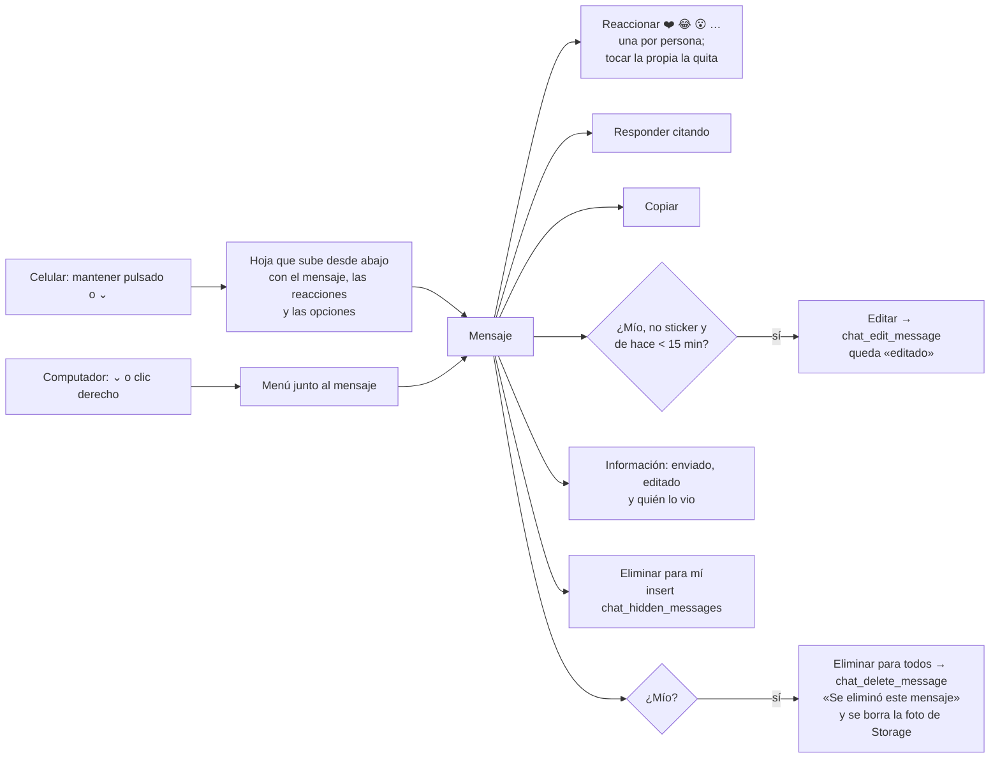
```mermaid
flowchart LR
  T["Celular: mantener pulsado o ⌄"] --> H["Hoja que sube desde abajo<br/>con el mensaje, las reacciones<br/>y las opciones"]
  D["Computador: ⌄ o clic derecho"] --> P["Menú junto al mensaje"]
  H --> M["Mensaje"]
  P --> M
  M --> RE["Reaccionar ❤️ 😂 😮 …<br/>una por persona;<br/>tocar la propia la quita"]
  M --> RS["Responder citando"]
  M --> CP["Copiar"]
  M --> ED{"¿Mío, no sticker y<br/>de hace < 15 min?"}
  ED -- "sí" --> EDT["Editar → chat_edit_message<br/>queda «editado»"]
  M --> IN["Información: enviado, editado<br/>y quién lo vio"]
  M --> DM["Eliminar para mí<br/>insert chat_hidden_messages"]
  M --> DA{"¿Mío?"}
  DA -- "sí" --> DAL["Eliminar para todos → chat_delete_message<br/>«Se eliminó este mensaje»<br/>y se borra la foto de Storage"]
```

### Cambios en vivo

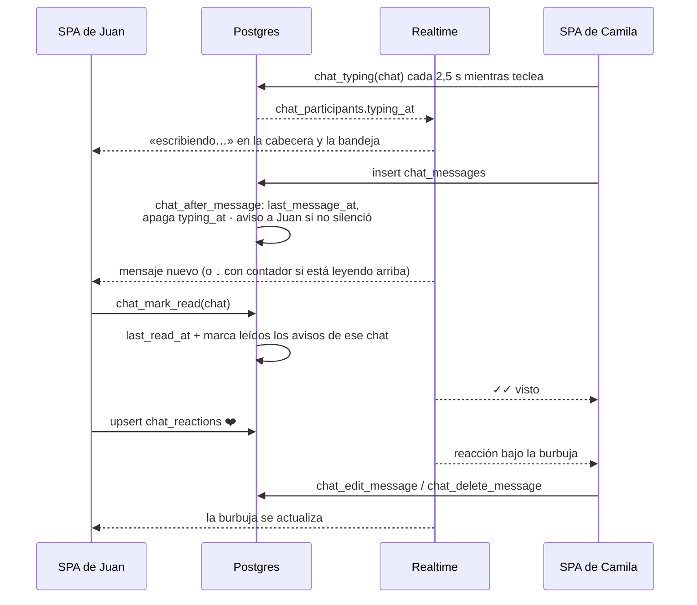
```mermaid
sequenceDiagram
  participant A as SPA de Juan
  participant DB as Postgres
  participant RT as Realtime
  participant B as SPA de Camila

  B->>DB: chat_typing(chat) cada 2,5 s mientras teclea
  DB-->>RT: chat_participants.typing_at
  RT-->>A: «escribiendo…» en la cabecera y la bandeja
  B->>DB: insert chat_messages
  DB->>DB: chat_after_message: last_message_at,<br/>apaga typing_at · aviso a Juan si no silenció
  RT-->>A: mensaje nuevo (o ↓ con contador si está leyendo arriba)
  A->>DB: chat_mark_read(chat)
  DB->>DB: last_read_at + marca leídos los avisos de ese chat
  RT-->>B: ✓✓ visto
  A->>DB: upsert chat_reactions ❤️
  RT-->>B: reacción bajo la burbuja
  B->>DB: chat_edit_message / chat_delete_message
  RT-->>A: la burbuja se actualiza
```

### La sala de antes

La migración `…1103000100_chat_app` convierte el chat único que existía en
una conversación, sin perder nada:

```mermaid
flowchart TD
  S{"¿Había mensajes?"} -- "no" --> F["Nada que mover"]
  S -- "sí" --> P["Personas: quienes escribieron<br/>o abrieron el chat"]
  P --> D{"¿Son dos?"}
  D -- "sí (Juan y Camila)" --> DI["Chat directo de los dos"]
  D -- "no" --> GR["Grupo «Nuestro chat»"]
  DI & GR --> C["Quedan como contactos entre sí<br/>y conservan hasta dónde leyeron"]
  C --> M["Todos los mensajes pasan<br/>a esa conversación"]
```

## Chat: respuestas, conexión y vistos

```mermaid
sequenceDiagram
  actor J as Juan
  participant A as SPA de Juan
  participant DB as Postgres
  participant RT as Realtime
  participant B as SPA de Camila
  actor C as Camila

  loop cada 30 s con la app a la vista
    B->>DB: chat_presence(false)
    DB-->>RT: chat_reads.last_seen_at
    RT-->>A: «Camila · en línea»<br/>(sólo quien comparte un chat con ella)
  end
  J->>A: escribe y envía
  A->>DB: insert chat_messages(conversation_id, body)
  A-->>J: ✓✓ entregado (Camila se conectó después)
  C->>B: abre ese chat
  B->>DB: chat_mark_read(chat)
  DB-->>RT: chat_participants.last_read_at
  RT-->>A: ✓✓ visto
  C->>B: desliza el mensaje o toca ↩
  B->>DB: insert chat_messages(body, reply_to)<br/>(la cita tiene que ser del mismo chat)
  RT-->>A: respuesta con la cita
  Note over A: Si Camila cierra la app, sin latidos<br/>pasa a «últ. vez hace…»
```

```mermaid
stateDiagram-v2
  [*] --> Enviando: enviar
  Enviando --> NoEnviado: error
  NoEnviado --> Enviando: Reintentar
  Enviando --> Enviado: guardado
  Enviado --> Entregado: la otra persona se conecta
  Entregado --> Visto: abre ese chat
  Enviado --> Visto: abre ese chat
  Enviado --> Editado: editar (15 min)
  Editado --> Visto
  Enviado --> Eliminado: eliminar para todos
  Visto --> Eliminado: eliminar para todos
```

## Chat: fotos y stickers

```mermaid
sequenceDiagram
  actor J as Juan
  participant A as SPA de Juan
  participant S as Storage chat-media
  participant DB as Postgres
  participant RT as Realtime
  participant B as SPA de Camila

  J->>A: 📷 elige fotos y escribe un mensaje
  A->>A: ImageProcessor: achica, quita metadatos, miniatura
  A-->>J: burbuja «Enviando foto…» con la vista previa
  A->>S: sube juan_id/id.webp y id.thumb.webp
  A->>DB: insert chat_messages(kind=image, rutas, body)
  alt el insert falla
    A->>S: borra lo que subió
    A-->>J: «No se envió»
  end
  DB-->>RT: mensaje nuevo
  RT-->>B: llega la foto
  B->>S: URL firmada de la miniatura
  Note over B: Al tocarla pide la foto grande
  J->>A: 😊 toca un sticker
  A->>DB: insert chat_messages(kind=sticker, sticker=id)
  RT-->>B: se dibuja con el catálogo de la app
```

## Avisos en el celular

Activar los avisos en un dispositivo:

```mermaid
sequenceDiagram
  actor P as Persona
  participant App as SPA
  participant SW as Service worker
  participant PS as Servicio push del navegador
  participant SP as send-push
  participant DB as Postgres

  P->>App: Mi cuenta → Activar avisos
  App->>P: el navegador pide permiso
  P-->>App: Permitir
  App->>SP: GET clave pública VAPID
  SP-->>App: publicKey
  App->>SW: pushManager.subscribe(publicKey)
  SW->>PS: registra el dispositivo
  PS-->>App: endpoint + claves
  App->>DB: register_push_subscription(endpoint, claves)
  Note over DB: el dispositivo queda a nombre<br/>de quien tiene la sesión
  P->>App: Enviar aviso de prueba
  App->>DB: send_test_notification()
  DB->>SP: trigger notifications_push (pg_net)
  SP->>PS: Web Push cifrado
  PS->>SW: evento push
  SW-->>P: aviso en la pantalla de notificaciones
  P->>App: Cerrar sesión
  App->>DB: borra la suscripción
  App->>SW: unsubscribe()
```

Qué ve cada persona en Mi cuenta:

```mermaid
flowchart TD
  A["Avisos en este dispositivo"] --> I{"¿iPhone fuera de la app<br/>de la pantalla de inicio?"}
  I -- "sí" --> H["Instrucciones: Compartir → Agregar a inicio"]
  I -- "no" --> S{"¿El navegador permite avisos?"}
  S -- "no" --> U["«Este navegador no permite avisos»"]
  S -- "sí" --> P{"Permiso"}
  P -- "sin pedir" --> B["Botón Activar avisos"]
  P -- "bloqueado" --> D["Cómo permitirlos en el navegador"]
  P -- "concedido" --> G["Activados ✓ + Enviar aviso de prueba"]
  B -- "Permitir" --> G
```

Cuándo sale un aviso al celular:

```mermaid
flowchart LR
  N["Notita nueva"] --> INS["insert notifications"]
  S["Sorpresa activa ya<br/>(sólo a su destinataria)"] --> INS
  L["Algo nuevo en una lista"] --> QL{"¿Hay un aviso de esa lista<br/>sin leer?"}
  QL -- "no" --> INS
  QL -- "sí" --> UPD
  C["Mensaje de chat"] --> MU{"¿Esa persona silenció<br/>el chat o bloqueó a quien escribe?"}
  MU -- "sí" --> NADA["Sin aviso"]
  MU -- "no" --> Q{"¿Hay un aviso sin leer<br/>de ese mismo chat?"}
  Q -- "no" --> INS
  CR["Solicitud de contacto<br/>o solicitud aceptada"] --> INS
  Q -- "sí" --> UPD["update del aviso<br/>con el último mensaje"]
  INS & UPD --> T["trigger notifications_push"]
  T --> V{"¿Vault tiene la URL<br/>y el secreto?"}
  V -- "no" --> X["Sólo campana en la app"]
  V -- "sí" --> SP["send-push → Web Push<br/>a cada dispositivo de la persona"]
  SP --> SW["Service worker: los del chat se agrupan<br/>en un aviso, y los de cada lista en otro"]
```

## App de celular

La app se instala como PWA (ver [APP_CELULAR.md](APP_CELULAR.md)). Qué ve
cada persona en `/app`, en el aviso del celular y en Mi cuenta:

```mermaid
flowchart TD
  A["Abre la página"] --> I{"¿Abierta desde el ícono<br/>(display-mode: standalone)?"}
  I -- "sí" --> OK["Ya instalada: sin aviso ni enlace<br/>«Descargar la app»"]
  I -- "no" --> D{"¿Qué dispositivo?"}
  D -- "Android / computador<br/>con beforeinstallprompt" --> B["Botón «Instalar la app»<br/>→ diálogo del sistema"]
  D -- "Android sin diálogo<br/>(Firefox, otros)" --> M["Pasos: menú ⋮ → Instalar app"]
  D -- "iPhone · Safari" --> S["Pasos: Compartir ⬆️ abajo<br/>→ Agregar a inicio"]
  D -- "iPhone · Chrome/Edge" --> C["Pasos: Compartir ⬆️ arriba<br/>→ Agregar a inicio"]
  D -- "computador" --> Q["Pasos + QR para abrir<br/>/app en el celular"]
  B -- "Instalar" --> OK
  A --> BN{"¿Celular, sin instalar, sin aviso de cookies,<br/>no cerrado en 21 días y fuera del chat?"}
  BN -- "sí (a los 4 s)" --> BA["Aviso abajo: «Instala la app»<br/>Instalar · Cómo · ×"]
```

Instalación, sin conexión y versión nueva:

```mermaid
sequenceDiagram
  actor P as Persona
  participant App as SPA (main.tsx)
  participant SW as sw.js
  participant C as Cache Storage
  participant N as Netlify

  App->>App: listenForInstallPrompt() antes de pintar
  App->>SW: register("/sw.js")
  SW->>N: "/", manifiesto, íconos y PRECACHE (JS/CSS del build)
  SW->>C: pages-VERSION + static-VERSION
  SW->>SW: primera vez: skipWaiting + clients.claim
  Note over P,N: Sin internet
  P->>App: abre la app desde el ícono
  App->>SW: navegación /listas
  SW->>N: fetch (falla)
  SW->>C: match("/", ignoreVary) → index.html
  SW-->>App: app guardada + módulos desde la caché
  App-->>P: lo último guardado + «Sin conexión»
  Note over P,N: Se publica una versión nueva
  P->>App: vuelve a la app (visibilitychange)
  App->>SW: registration.update()
  SW->>N: sw.js con otra VERSION
  SW->>C: precarga la versión nueva (queda "waiting")
  App-->>P: «✨ Hay una versión nueva · Actualizar»
  P->>App: Actualizar
  App->>SW: postMessage SKIP_WAITING
  SW->>C: borra las cachés de la versión anterior (las fotos se quedan)
  SW-->>App: controllerchange → recarga
```

Cómo se arma en el build y, si se quiere, en Play Store:

```mermaid
flowchart LR
  V["vite build"] --> B["dist/assets/*.js|css"]
  B --> PL["pwaPlugin (scripts/pwa.mjs)"]
  PL --> SWF["dist/sw.js<br/>PRECACHE + VERSION = huella"]
  E{"¿ANDROID_PACKAGE_NAME y<br/>ANDROID_CERT_SHA256 en Netlify?"} -- "sí" --> AL["dist/.well-known/assetlinks.json"]
  E -- "no" --> NO["no se publica"]
  PWB["PWABuilder / Bubblewrap"] --> AAB[".aab (Trusted Web Activity)"]
  AAB --> GP["Google Play"]
  GP -. "verifica el dominio" .-> AL
  GP --> TWA["App Android: abre el sitio<br/>a pantalla completa"]
```

## Sorpresas para una persona

Cada sorpresa se prepara para alguien en concreto. Sólo esa persona la ve al
abrir la página y sólo a ella le llega el aviso; a quien la creó nunca le sale,
y en el panel cada quien ve únicamente las que preparó (así las que le
prepararon a ella no se destapan).

```mermaid
sequenceDiagram
  autonumber
  actor J as Juan (crea)
  participant P as Panel → Sorpresas
  participant DB as Postgres (RLS)
  actor C as Camila (destinataria)
  J->>P: + Nueva sorpresa, «¿Para quién es?» = Camila
  P->>DB: insert interruptions (recipient_id = Camila)
  Note over DB: trigger stamp_created_by pone created_by = Juan<br/>la política exige recipient_id ≠ created_by<br/>y que sea una cuenta activa
  DB-->>C: notify_new_interruption → aviso sólo a Camila
  J->>DB: abre la página: select interruptions activas
  DB-->>J: (nada para él: no es la destinataria)
  C->>DB: abre la página: select interruptions activas
  DB-->>C: la sorpresa (recipient_id = Camila)
  C->>C: ventana / confeti / corazones
  C->>DB: insert interruption_views (si es de una sola vez)
  C->>DB: abre la Cajita: select interruptions recibidas
  DB-->>C: la sorpresa sigue ahí, aunque ya la vio o venció
```

Quién puede ver una sorpresa:

```mermaid
flowchart TD
  U["Persona que abre la página"] --> S{"¿Inició sesión?"}
  S -- "no" --> N["No ve sorpresas"]
  S -- "sí" --> A{"¿La creó ella?"}
  A -- "sí" --> PANEL["No le sale en la página<br/>(la ve y edita en su panel)"]
  A -- "no" --> R{"¿Es la destinataria?<br/>(o es antigua, sin destinataria)"}
  R -- "no" --> N
  R -- "sí" --> V{"¿Activa y dentro<br/>de su ventana de tiempo?"}
  V -- "no" --> N
  V -- "sí" --> OK["Le sale la sorpresa 🎁"]
```

### Sorpresas recibidas en la Cajita

Lo que ya le llegó a la destinataria no desaparece: después de verla en la
página (o si nunca la abrió a tiempo y la sorpresa venció), queda guardada en
**Cajita → Recibidas** como un sobre 🎁 más, junto a las notitas. El aviso
de la campana lleva ahí. No tiene botón de borrar: la sorpresa es de quien la
creó.

```mermaid
flowchart TD
  R["Sorpresa para Camila"] --> E{"¿Ya empezó?<br/>(starts_at ≤ ahora)"}
  E -- "no" --> H["Oculta: todavía es sorpresa"]
  E -- "sí" --> A{"¿Sigue activa?"}
  A -- "sí" --> OK["En Cajita → Recibidas 🎁<br/>(aunque ya venció o ya la vio)"]
  A -- "no, la apagaron" --> V{"¿Ya la había visto?<br/>(interruption_views)"}
  V -- "sí" --> OK
  V -- "no" --> H2["No le aparece"]
  OK --> O["Al abrirla se marca vista:<br/>ya no vuelve a salir en la página"]
```

## Colores por persona

```mermaid
flowchart TD
  A["Se abre la app"] --> B["site_settings.theme<br/>(Rosa vino, lo cambia Juan en Apariencia)"]
  B --> C{"¿Hay sesión y la persona<br/>eligió sus colores?"}
  C -- "no" --> D["Se ve la paleta de la página"]
  C -- "sí" --> E["personalTheme():<br/>la página + profiles.theme_colors encima"]
  E --> F["ThemeController pone las<br/>custom properties en :root"]
  D --> F
  G["Mi cuenta → Mis colores → Guardar"] --> H["update profiles.theme_colors<br/>(sólo la propia fila, sólo #rrggbb)"]
  H --> C
  S["Fecha especial de hoy<br/>(cumpleaños, Halloween, Navidad…)"] -. "gana sobre todo" .-> F
```

## Temas de fechas especiales

Qué tema se ve cada día. Todo pasa en el navegador con la hora del teléfono:
el tema empieza a las 00:00 y se quita a las 00:00 del día siguiente, aunque la
página siga abierta.

```mermaid
flowchart TD
  A["Se abre la app<br/>(o da la medianoche)"] --> P{"¿Hay vista previa?<br/>?tema=… en esta pestaña"}
  P -- "sí" --> V["previewSpecialDay(id)<br/>+ franja «Vista previa · Quitar»"]
  P -- "no" --> E{"¿effects.specialDays.enabled?"}
  E -- "no" --> N["Tema de siempre<br/>(página + colores de cada persona)"]
  E -- "sí" --> O["specialDayOn(): recorre en orden<br/>1 🎂 su cumpleaños · 2 💍 aniversario (no si la relación terminó)<br/>3 💘 San Valentín · 4 💛 Amor y Amistad<br/>5 🎃 Halloween · 6 🎄 Navidad · 7 🎆 Año Nuevo"]
  O --> Q{"¿Hoy cae alguna<br/>que no esté apagada?"}
  Q -- "no" --> N
  Q -- "sí, la primera que coincide" --> D["Fecha especial del día"]
  V --> D
  D --> T["specialTheme(): sus colores encima del tema<br/>de la página, también para quien tiene los suyos"]
  D --> R["html[data-special=…]: borde de fiesta,<br/>detalles por fecha en _special.scss"]
  D --> H["Portada: saludo grande<br/>«¡Feliz cumpleaños, Camila!»"]
  D --> F["Emojis del día flotando<br/>+ lluvia de bienvenida (1 vez por día)"]
  D --> B["Franja bajo la cabecera<br/>en las demás páginas (no en el chat)"]
  T --> C["ThemeController → variables CSS en :root"]
```

Cómo se arma la escena de cada fecha (`SpecialDayGarland` y `SpecialDayScene`):

```mermaid
flowchart TD
  D["Fecha especial del día<br/>style.scene"] --> G["Guirnalda bajo la cabecera<br/>emojis · luces de colores · banderines"]
  D --> Q{"¿Reducir animaciones?"}
  Q -- "no" --> M["En movimiento"]
  Q -- "sí" --> S["Sólo lo quieto"]
  M --> F["Cae meciéndose: nieve, hojas,<br/>pétalos, confeti de papelitos"]
  M --> V["Cruza volando: murciélagos,<br/>la bruja, el trineo, estrellas fugaces"]
  M --> W["Fuegos artificiales (Año Nuevo)"]
  M & S --> H["Cuelga de un hilo: arañas,<br/>calaveras, campanas, globos"]
  M & S --> T["Suelo: calabazas, tumbas, calaveras,<br/>árboles, muñecos de nieve, regalos"]
  M & S --> C["Telarañas en las esquinas (Halloween)"]
  D --> P["Toda la página: fondo propio (luna, nieve,<br/>confeti, cielo de noche), cabecera,<br/>tarjetas, botones y títulos"]
  X["Chat a pantalla completa"] -. "sin escena" .-> D
```

| Fecha | Guirnalda | Cae | Vuela | Cuelga | Suelo |
| --- | --- | --- | --- | --- | --- |
| 🎂 Cumpleaños | Banderines | Confeti, 🎊 | — | 🎈 🎀 | 🎁 🎂 🎈 🥳 |
| 💍 Aniversario | 💍 ❤️ 🥂 | 🌹 ❤️ ✨ | 🕊️ | — | 🌹 🥂 💐 |
| 💘 San Valentín | ❤️ 💕 💘 | 💗 🌸 | 💘 | — | 🌹 💝 💌 🧸 |
| 💛 Amor y Amistad | Banderines | 🌼 💛 🧡 | 🦋 | — | 🌻 🎁 🌷 |
| 🎃 Halloween | 🎃 💀 🦇 | 🍂 🍁 | 🦇 🧙‍♀️ | 🕷️ 💀 + telarañas | 🎃 🪦 💀 🕯️ 🍬 |
| 🎄 Navidad | Luces de colores | ❄️ nieve | 🛷 | 🔔 ⭐ 🎀 | 🎄 🎁 ☃️ 🦌 🎅 |
| 🎆 Año Nuevo | Luces doradas | ✨ ⭐ + confeti | 🌠 | — | 🍾 🥂 🎉 🕛 + fuegos artificiales |

De dónde sale cada fecha:

```mermaid
flowchart LR
  subgraph AJ["Apariencia → Fechas especiales (effects.specialDays)"]
    BD["birthday + birthdayName<br/>(a mano o tomado del perfil de una cuenta)"]
    OFF["off: fechas apagadas"]
    EN["enabled"]
  end
  RS["Ajustes del sitio →<br/>fecha en que empezó todo"] --> ANI["💍 Aniversario<br/>(desde el primer año)"]
  RE["Ajustes del sitio →<br/>fecha en que terminó"] -. "con fecha: se apaga" .-> ANI
  BD --> CUM["🎂 Cumpleaños<br/>(29 feb → 28 en años no bisiestos)"]
  FIJ["Calendario"] --> F1["💘 14 feb · 🎃 31 oct<br/>🎄 24 y 25 dic · 🎆 31 dic y 1 ene"]
  FIJ --> F2["💛 Tercer sábado de septiembre<br/>(Amor y Amistad, Colombia)"]
```

```mermaid
sequenceDiagram
  actor J as Juan (theme.manage)
  participant A as Apariencia
  participant DB as site_settings.effects
  participant RT as Realtime
  participant App as App de quien mira

  J->>A: nombre «Camila» + fecha de su cumpleaños
  J->>A: «Ver cómo se ve» (Halloween)
  A->>App: /?tema=halloween (sólo esta pestaña)
  J->>A: Guardar cambios
  A->>DB: update effects (guard_site_settings exige theme.manage)
  DB-->>RT: cambio en site_settings
  RT-->>App: recarga los ajustes
  Note over App: el día de su cumpleaños, de 00:00 a 23:59,<br/>toda la app se viste de cumpleaños para todos
```

## Fin de la relación

Qué cambia cuando hay `relationship_end` (en la base real, el 31 de octubre de
2026). No se borra nada: si se quita la fecha, todo vuelve a como estaba.

```mermaid
flowchart TD
  S["site_settings<br/>relationship_start · relationship_end"] --> Q{"¿Hay fecha de fin?<br/>relationshipEnded()"}
  Q -- "no" --> T["Contador que suma cada segundo<br/>«Juntos desde el …»"]
  Q -- "no" --> A1["💍 Aniversario celebrado<br/>y en las cuentas regresivas"]
  Q -- "sí" --> C["counterUntil(): el contador queda quieto<br/>en el día del final (518 días, sin reloj)"]
  C --> C2["«Fueron 17 meses que guardo con cariño»<br/>«El tiempo que compartimos, del … al …»"]
  Q -- "sí" --> H["Portada: «Del 31 de mayo de 2025<br/>al 31 de octubre de 2026»"]
  Q -- "sí" --> A["anniversaryStart() = null<br/>specialDayOn() ya no lo celebra"]
  Q -- "sí" --> CD["countdownDates() / pausedByEnd(): sin el aniversario<br/>ni las fechas only_together («Navidad juntos»)<br/>(portada, Fechas que esperamos, Panel)"]
  Q -- "sí" --> SUB["Contador sin subtítulo<br/>(«Y contando…» se oculta)"]
  Q -- "sí" --> K["🎂 Cumpleaños, otras fechas, fotos,<br/>dedicatorias, chat y listas: igual"]
```

```mermaid
sequenceDiagram
  actor J as Juan (settings.manage)
  participant A as Super → Ajustes del sitio
  participant DB as site_settings
  participant RT as Realtime
  participant App as App de quien mira

  J->>A: Fecha en que terminó = 31/10/2026
  A->>A: validRelationshipEnd(): no antes del inicio
  A->>DB: update relationship_end
  Note over DB: guard_site_settings exige settings.manage<br/>check: fin ≥ inicio
  DB-->>RT: cambio en site_settings
  RT-->>App: recarga los ajustes
  Note over App: contador quieto, «Del … al …»,<br/>sin aniversario
```

## Perfil de cada persona

Qué se ve en el círculo de cada persona (cabecera, Mi cuenta, chat y listas):

```mermaid
flowchart TD
  A["Avatar(persona)"] --> B{"¿Tiene avatar_path?"}
  B -- "sí" --> C["resolveAvatars():<br/>URL firmada del bucket avatars"]
  C --> F["Foto en círculo"]
  B -- "no" --> D{"¿Eligió un icono?<br/>avatar_emoji"}
  D -- "sí" --> E["El icono (🌻, 🐱, 🌙…)"]
  D -- "no" --> G["La inicial del nombre"]
```

Cambiar la foto en **Mi cuenta → Editar perfil**:

```mermaid
sequenceDiagram
  actor P as Persona
  participant App as Mi perfil
  participant W as Web Worker
  participant ST as Storage (avatars)
  participant DB as Postgres

  P->>App: 📷 Subir foto
  App->>W: reduce a 512 px, quita metadatos (GPS)
  W-->>App: WebP liviano
  App->>ST: sube a avatars/<su id>/<uuid>.webp
  Note over ST: la política sólo deja subir<br/>a la carpeta propia (2 MB)
  App->>DB: update profiles.avatar_path
  Note over DB: guard_profile_changes: sólo<br/>la dueña o el dueño cambia<br/>foto, icono, frase y cumpleaños
  alt se guardó
    App->>ST: borra la foto anterior
    App-->>P: «Foto actualizada 📸»
  else falló
    App->>ST: borra la foto recién subida
    App-->>P: aviso de error
  end
```

En el chat, tocar a la otra persona abre su tarjeta de perfil: foto en
grande, frase y cuenta regresiva a su cumpleaños (sólo día y mes).

## Listas compartidas

Diagramas de la sección **Listas** (cosas por hacer entre dos o en grupo).

### Crear una lista y trabajar juntos

```mermaid
sequenceDiagram
  actor J as Juan
  participant App as SPA
  participant DB as Postgres
  participant RT as Realtime
  actor C as Camila

  J->>App: Listas → Nueva lista (elige a Camila)
  App->>DB: create_todo_list(nombre, icono, fecha, [Camila])
  Note over DB: add_list_owner suma a Juan<br/>y se suma a Camila
  DB-->>C: aviso «Juan te sumó a la lista…» (campana y celular)
  J->>App: Agrega «Comprar bloqueador»
  App->>DB: insert todo_items (RLS: is_list_member)
  DB-->>C: aviso «➕ Comprar bloqueador»<br/>(actualiza el de esa lista si no lo leyó)
  RT-->>C: la tarea aparece sin recargar
  C->>App: Abre la tarea: subtareas, materiales, fotos
  App->>DB: insert todo_materials / todo_item_images
  App->>DB: sube la foto a list-media/<list_id>/
  C->>App: Marca la tarea como hecha
  App->>DB: update done_at
  Note over DB: guard_todo_item pone la hora<br/>y done_by = Camila
  DB-->>J: aviso «✅ Comprar bloqueador»
  RT-->>J: la tarea pasa a «Hechas»
```

### Cómo está armada una lista

Cada lista tiene miembros y tareas; cada tarea puede tener un nivel de
subtareas, materiales y hasta 12 fotos. Al borrar la lista se borra todo lo
de adentro (`on delete cascade`) y la app borra también sus fotos del bucket.

```mermaid
classDiagram
  direction LR
  class Lista {
    icono y nombre
    descripción
    fecha límite
    dueña o dueño
  }
  class Miembro {
    persona con lists.use
    quién la sumó
  }
  class Tarea {
    título y descripción
    fecha
    responsable: un miembro
    hecha: cuándo y quién
  }
  class Subtarea {
    título
    hecha: cuándo y quién
  }
  class Material {
    nombre
    cantidad
    listo sí/no
  }
  class Foto {
    list-media/lista/archivo.webp
    miniatura
  }
  Lista "1" *-- "1..*" Miembro : comparten
  Lista "1" *-- "0..*" Tarea : tiene
  Tarea "1" *-- "0..*" Subtarea : un solo nivel
  Tarea "1" *-- "0..*" Material : necesita
  Tarea "1" *-- "0..12" Foto : fotos
```

### Pantallas

```mermaid
flowchart LR
  NAV["Cabecera → Listas<br/>(contador de avisos)"] --> L["/listas<br/>tarjetas con avance,<br/>fecha y caras"]
  BELL["Campana o aviso<br/>en el celular"] --> D
  L -- "+ Nueva lista" --> NL["Ventana: con quién,<br/>icono, nombre, fecha"]
  NL -- "Crear lista" --> D["/listas/:id<br/>avance, agregar tarea,<br/>pendientes y hechas"]
  L -- "toca una tarjeta" --> D
  D -- "toca una tarea" --> T["Detalle de la tarea:<br/>fecha, responsable, descripción,<br/>subtareas, materiales, fotos"]
  D -- "⚙️ Ajustes" --> S["Ajustes: datos de la lista,<br/>sumar o sacar personas,<br/>salirse o borrarla"]
  T -- "Listo" --> D
  S -- "salirse o borrar" --> L
```

### Estados de una tarea

```mermaid
stateDiagram-v2
  [*] --> Pendiente: se agrega
  Pendiente --> Hecha: se marca ✓
  Hecha --> Pendiente: se desmarca
  Hecha --> [*]: se borra
  Pendiente --> [*]: se borra
  state Pendiente {
    state "Sin fecha" as SinFecha
    state "Más adelante" as Mas_adelante
    state "Pronto (3 días o menos)" as Pronto
    state "Vence hoy" as Hoy
    [*] --> SinFecha
    SinFecha --> Mas_adelante: se le pone fecha
    Mas_adelante --> Pronto: faltan 3 días o menos
    Pronto --> Hoy: es el día
    Hoy --> Vencida: pasó la fecha
  }
  note right of Hecha
    guard_todo_item pone done_at y done_by;
    el navegador no puede inventarlos.
    Si era la última, salen 🎉 y confeti.
  end note
```

La etiqueta de la fecha sale de `dueState()` y `dueLabel()` en
`domain/lists.ts`: «En 5 días», «Mañana», «Vence hoy», «Venció hace 2 días».
Las subtareas se tachan igual, pero no cambian el avance de la lista, que
cuenta sólo las tareas principales.

### Quién recibe cada aviso

```mermaid
flowchart TD
  E1["Te suman a una lista"] --> N1["Aviso propio:<br/>«Juan te sumó a la lista…»<br/>enlace /listas/:id?nueva=1"]
  E2["Alguien agrega una tarea"] --> G["notify_list_members()"]
  E3["Alguien termina una tarea"] --> G
  E4["Alguien te asigna una tarea"] --> G1["notify_list_members()<br/>sólo para la persona asignada"]
  G --> R["Para cada miembro<br/>menos quien lo hizo<br/>y que tenga lists.use"]
  G1 --> R
  R --> Q{"¿Ya tiene un aviso sin leer<br/>de esta lista?"}
  Q -- "sí" --> U["Se actualiza ese aviso<br/>(texto y hora)"]
  Q -- "no" --> I["Se crea uno nuevo"]
  N1 & U & I --> P["dispatch_push → send-push<br/>(celular, agrupado con<br/>tag list:/listas/:id)"]
  N1 & U & I --> C["Campana y contador<br/>de Listas en la cabecera"]
  C --> V{"¿La persona ya está<br/>en esa lista?"}
  V -- "sí" --> M["No sale el globo<br/>y el aviso se marca leído"]
  V -- "no" --> T["Globo emergente"]
```

### Fotos de una tarea

```mermaid
sequenceDiagram
  actor P as Miembro
  participant App as Detalle de la tarea
  participant W as Web Worker
  participant ST as Storage (list-media)
  participant DB as Postgres

  P->>App: 📷 Agregar fotos
  App->>W: corrige orientación, quita GPS,<br/>reduce y genera miniatura
  W-->>App: WebP + miniatura
  App->>ST: sube a list-media/<list_id>/<uuid>.webp
  Note over ST: is_list_folder_member: sólo<br/>miembros de esa lista suben,<br/>ven o borran en su carpeta
  App->>DB: insert todo_item_images
  Note over DB: guard_todo_image: la ruta debe<br/>ser de la lista y máximo 12 por tarea
  alt se guardó
    DB-->>App: foto registrada
    App->>ST: URLs firmadas (1 h) para mostrarlas
  else falló
    App->>ST: borra lo que alcanzó a subir
    App-->>P: aviso de error
  end
```

### Cambios en vivo

```mermaid
sequenceDiagram
  actor C as Camila
  participant A as App de Camila
  participant DB as Postgres
  participant RT as Realtime
  participant B as App de Juan
  actor J as Juan

  C->>A: marca «Reservar hotel» ✓
  A->>A: la tacha al instante (optimista)
  A->>DB: update done_at
  DB-->>RT: cambio en todo_items
  RT-->>B: aviso de cambio (RLS: sólo miembros)
  Note over B: junta los cambios 250 ms<br/>y recarga la lista una vez
  B-->>J: la tarea pasa a «Hechas»
  alt falló el guardado
    DB-->>A: error
    A->>DB: recarga lo real
    A-->>C: aviso de error
  end
```

Las cinco tablas (`todo_lists`, `todo_list_members`, `todo_items`,
`todo_materials`, `todo_item_images`) están en la publicación de Realtime.

### Qué puede hacer cada miembro

```mermaid
flowchart TD
  P["Persona con sesión"] --> U{"¿Tiene lists.use?"}
  U -- "no" --> N["No ve listas"]
  U -- "sí" --> M{"¿Es miembro de la lista?"}
  M -- "no" --> X["No la ve (RLS)"]
  M -- "sí" --> A["Ver, agregar, editar, tachar y borrar<br/>tareas, subtareas, materiales y fotos"]
  A --> S["Sumar a alguien que use listas"]
  A --> L["Salirse"]
  M -- "sí, la creó" --> O["Además: sacar a otros<br/>y borrar la lista"]
```

### Sumar, sacar, salirse y borrar

```mermaid
flowchart TD
  A["⚙️ Ajustes de la lista"] --> B{"¿Qué quiere hacer?"}
  B -- "Sumar a alguien" --> C{"¿Esa persona<br/>tiene lists.use?"}
  C -- "no" --> CX["No aparece para elegir<br/>(y la base lo rechaza)"]
  C -- "sí" --> CS["insert todo_list_members<br/>→ aviso «te sumó a la lista»"]
  B -- "Sacar a alguien" --> D{"¿Quien lo pide<br/>creó la lista?"}
  D -- "no" --> DX["No puede (RLS)"]
  D -- "sí" --> DS["delete todo_list_members<br/>→ deja de verla"]
  B -- "Salirme" --> E{"¿Creó la lista?"}
  E -- "no" --> ES["Se borra su membresía<br/>y vuelve a /listas"]
  E -- "sí" --> EX["En su lugar ve<br/>«Borrar lista»"]
  B -- "Borrar lista" --> F{"¿La creó?"}
  F -- "sí" --> FS["delete todo_lists (cascade)<br/>+ borra sus fotos del bucket"]
  F -- "no" --> FX["No puede (RLS)"]
```

## Dedicatorias y playlist

Diagramas de la sección **Dedicatorias**: cartas con fotos y canciones, y la
playlist que se arma con todas las canciones.

### Escribir una dedicatoria

```mermaid
sequenceDiagram
  actor J as Juan
  participant App as SPA
  participant W as Workers de imagen
  participant DB as Postgres
  participant ST as Storage (dedication-media)
  actor C as Camila

  J->>App: Dedicatorias → + Nueva dedicatoria
  J->>App: Mensaje, emoji, «para» Camila (o «Para todos»),<br/>fotos y canciones (enlaces o audios)
  App->>DB: insert dedications
  Note over DB: guard_dedication pone author_id = Juan<br/>y revisa que Camila tenga dedications.use
  DB-->>C: aviso «Juan te dedicó algo 🎶»<br/>(campana y celular, enlace /dedicatorias/:id)
  App->>W: optimiza cada foto (WebP + miniatura)
  App->>ST: sube a dedication-media/<id>/<uuid>.webp
  App->>DB: insert dedication_photos (máx. 12)
  App->>ST: sube el audio a dedication-media/<id>/<uuid>.mp3
  App->>DB: insert dedication_songs (máx. 50,<br/>source youtube · spotify · audio · link)
  C->>App: Abre el aviso
  App->>DB: select dedication + fotos + canciones (RLS: can_see_dedication)
  App->>ST: URLs firmadas de fotos y audios
  App-->>C: la carta, las fotos y ▶ Escuchar todas
```

### Quién ve qué

```mermaid
flowchart TD
  P["Persona con sesión"] --> U{"¿Tiene dedications.use?"}
  U -- "no" --> N["No ve la sección"]
  U -- "sí" --> V{"¿La escribió, es para ella<br/>o es «Para todos»?"}
  V -- "sí" --> SEE["La ve con sus fotos y canciones<br/>(can_see_dedication en tablas y bucket)"]
  V -- "no" --> HIDE["No la ve"]
  SEE --> A{"¿La escribió?"}
  A -- "sí" --> EDIT["Edita texto, fotos y canciones,<br/>cambia el orden y la borra"]
  A -- "no" --> LISTEN["Sólo la lee y la escucha"]
```

### El reproductor

```mermaid
flowchart LR
  PLAY["▶ en una dedicatoria<br/>o en la playlist"] --> CTX["PlayerContext<br/>cola, orden, mezcla"]
  CTX --> FOCUS["claimAudio('playlist')<br/>pausa la música de fondo"]
  CTX --> MP["MiniPlayer<br/>(abajo, sigue al navegar)"]
  MP --> T{"¿De dónde es?"}
  T -- "youtube" --> YT["iframe youtube-nocookie<br/>enablejsapi + postMessage"]
  T -- "spotify" --> SP["iframe open.spotify.com/embed"]
  T -- "audio" --> AU["&lt;audio&gt; con URL firmada"]
  T -- "link" --> LK["Botón «Abrir enlace»"]
  YT -- "onStateChange = 0 (terminó)" --> NEXT["Siguiente"]
  AU -- "ended" --> NEXT
  SP -. "no avisa al terminar:<br/>se usa ⏭" .-> NEXT
  NEXT --> CTX
  MP --> MS["Media Session:<br/>título y botones en<br/>la pantalla bloqueada"]
```

### Quién la vio

Al abrir una dedicatoria que no escribió, cada persona queda anotada (la
primera y la última vez). Sólo quien la escribió ve la lista.

```mermaid
sequenceDiagram
  actor C as Camila
  participant App as SPA
  participant DB as Postgres
  actor J as Juan (la escribió)

  C->>App: abre /dedicatorias/:id
  App->>DB: rpc mark_dedication_seen(id)
  DB->>DB: ¿can_see_dedication? ¿no es la autora?
  DB->>DB: upsert dedication_views<br/>(first_seen_at, last_seen_at)
  DB-->>J: Realtime: cambio en dedication_views
  J->>App: abre su dedicatoria o la lista
  App->>DB: select dedication_views<br/>(RLS: sólo la autora ve todas)
  App-->>J: 👀 Quién la vio: Camila, hace 3 min<br/>Todavía no: Valentina
```

### Importar y exportar

```mermaid
flowchart LR
  subgraph Entrar["Importar"]
    PASTE["Enlaces pegados<br/>(uno por línea,<br/>«Artista - Título»)"]
    FILE[".m3u / .m3u8<br/>(#EXTINF)"]
  end
  PASTE & FILE --> PARSE["parsePlaylistText:<br/>sólo https, sin repetidos,<br/>limpia ?si= y rastreo"]
  PARSE --> REVIEW["Vista previa con<br/>títulos editables"]
  REVIEW --> TARGET{"¿A dónde?"}
  TARGET --> NEWD["Nueva dedicatoria"]
  TARGET --> MINE["Una dedicatoria mía"]
  NEWD & MINE --> SONGS[("dedication_songs")]
  SONGS --> PL["Playlist: todas las que veo,<br/>de la más antigua a la más nueva<br/>o al revés"]
  subgraph Salir["Exportar"]
    M3U["⬇️ .m3u8<br/>(VLC, Winamp, Kodi,<br/>TuneMyMusic, Soundiiz)"]
    YTQ["Cola de YouTube<br/>watch_videos (máx. 50)"]
    SPL["Enlaces de Spotify<br/>(Ctrl+V en una playlist)"]
    TXT["Lista en texto"]
  end
  PL --> M3U & YTQ & SPL & TXT
```

Los audios subidos se quedan en la app: el `.m3u8` los nombra en un
comentario, pero no los incluye porque sus enlaces firmados vencen.

## Tutorial guiado

```mermaid
stateDiagram-v2
  [*] --> Cerrado
  Cerrado --> Abierto: clic en «? Tutorial»
  state Abierto {
    [*] --> Paso
    Paso --> Paso: Siguiente / →
    Paso --> Paso: Anterior / ←
  }
  Abierto --> Cerrado: Cerrar, ✕ o Esc
  Abierto --> Cerrado: Terminar (último paso)
  Abierto --> Cerrado: cambio de página
```

```mermaid
flowchart LR
  R["Ruta actual + AccessPolicy"] --> T["tourFor()<br/>pasos de la página + menú permitido"]
  T --> O{"¿Paso opcional<br/>sin destino?"}
  O -- "sí" --> SKIP["Se omite"]
  O -- "no" --> F["Primer destino visible<br/>data-tour o ☰ en móvil"]
  F --> L["tourLayout<br/>resaltado + posición de la tarjeta"]
```

### Novedades de cada versión

```mermaid
sequenceDiagram
  actor C as Camila
  participant SW as Service worker
  participant App as SPA
  participant WN as WhatsNew
  participant T as GuidedTour

  SW-->>C: «Hay una versión nueva» → Actualizar
  C->>App: la app se recarga con la versión nueva
  App->>App: ConsentGate: términos aceptados
  App->>WN: pendingReleases(RELEASES, última vista, alta de la cuenta)
  WN->>WN: sólo lo que su cuenta puede usar (permisos)
  WN-->>C: ✨ Novedades: tarjetas + «Además»
  alt Ver cómo funciona
    C->>WN: toca el botón de la novedad
    WN->>WN: guarda la versión como vista
    WN->>T: requestTour(página, presentación)
    WN->>App: navega a la página (p. ej. /dedicatorias)
    T->>T: espera a que cargue lo que va a señalar
    T-->>C: presentación → pasos de la página → botón «?»
  else ¡Entendido!
    C->>WN: cierra
    WN->>WN: guarda la versión como vista
  end
```

```mermaid
flowchart TD
  E["Entra con sesión"] --> S{"¿Vio alguna versión<br/>en este navegador?"}
  S -- "sí" --> P["Todas las posteriores"]
  S -- "no" --> N{"¿Su cuenta es más nueva<br/>que la última versión?"}
  N -- "sí" --> M["Nada: se guarda la última como vista"]
  N -- "no" --> L["Sólo la última"]
  P & L --> F["Quita las novedades de lo que<br/>su cuenta no puede usar"]
  F --> V{"¿Queda algo?"}
  V -- "sí" --> W["Ventana ✨ Novedades"]
  V -- "no" --> X["No se muestra"]
```

## Idiomas

Cómo elige la app el idioma al abrir y qué pasa al cambiarlo.

```mermaid
flowchart TD
  A["Abrir la app (main.tsx)"] --> B{"¿Hay idioma guardado?<br/>localStorage app:lang"}
  B -- "sí" --> L["Ese idioma"]
  B -- "no" --> C["navigator.languages<br/>matchLocale()"]
  C -- "pt-*" --> PT["pt"]
  C -- "en-*" --> EN["en"]
  C -- "otro" --> ES["es (base)"]
  PT --> D["Descarga el diccionario<br/>(chunk aparte)"]
  EN --> D
  L --> D
  ES --> R["Pinta la app"]
  D --> R
  R --> H["&lt;html lang&gt;, títulos SEO,<br/>fechas con Intl"]
```

```mermaid
sequenceDiagram
  actor P as Persona
  participant S as Selector 🌐
  participant I as i18n/store
  participant LS as localStorage
  participant C as Componentes (useT)
  P->>S: Elige «English»
  S->>I: setLocale("en")
  I->>I: import("./messages/en") si no estaba
  I->>LS: guarda app:lang = en
  I->>C: avisa a los suscriptores
  C-->>P: Toda la app en inglés, sin recargar
```

```mermaid
flowchart LR
  DB["Postgres / modo demo<br/>(mensajes en español)"] --> E["core/errors.ts<br/>fromServer() · toUserMessage()"]
  EF["Edge Functions<br/>(mensajes en español)"] --> E
  E -- "conocido" --> T["errors.backend / errors.server<br/>del idioma activo"]
  E -- "desconocido" --> G["Texto tal cual o<br/>«Algo salió mal»"]
```

El contenido que se escribe en el panel: el original en español y, en cada
fila, sus traducciones.

```mermaid
flowchart LR
  ED["Editor del panel<br/>pestañas Español · English · Português"] -- "original" --> COL["Columnas de la fila<br/>title, subtitle, content…"]
  ED -- "traducción" --> TR["translations (jsonb)<br/>{ en: {…}, pt: {…} }"]
  COL --> LZ["localizeContent()<br/>superpone la traducción<br/>del idioma activo"]
  TR --> LZ
  LZ --> PG["Página, cabecera y SEO<br/>(useLocalizedContent)"]
  LZ -. "texto sin traducir" .-> ES["Se muestra en español"]
```

## Capas de seguridad

Qué frena a cada amenaza de la
[lista de verificación](SEGURIDAD_OWASP.md#lista-de-verificación), desde el
navegador hasta la base de datos.

```mermaid
flowchart TB
  subgraph Navegador
    CSP["CSP sin scripts ajenos<br/>React escapa el texto<br/>validation.ts: colores, URLs, fuentes"]
    SES["Sesión en local/sessionStorage<br/>(sin cookies) · PKCE"]
    CAP["CAPTCHA Turnstile (opcional)<br/>entrar · recuperar · invitación"]
  end
  subgraph Netlify
    HTTPS["Sólo HTTPS<br/>HSTS + upgrade-insecure-requests"]
    HDR["Cabeceras: X-Frame-Options, nosniff,<br/>COOP/CORP, Permissions-Policy"]
  end
  subgraph Supabase
    AUTH["Auth: bcrypt, tokens de 1 h con rotación,<br/>registro cerrado, límites por IP,<br/>verificación en dos pasos (TOTP, opcional)"]
    subgraph EF["Edge Functions"]
      RL["hit_edge_rate_limit<br/>IP con HMAC · 429"]
      VAL["validan y recortan cada campo"]
    end
    subgraph PG["Postgres"]
      PRE["check_request(): sin el código<br/>de dos pasos no hay respuesta"]
      RLS["RLS en todas las tablas<br/>+ política restrictiva de dos pasos"]
      TRG["Triggers: columnas inmutables,<br/>autoría puesta por la base,<br/>enforce_rate_limit"]
      CHK["CHECK de largo y formato"]
      PRM["supabase-js / PostgREST:<br/>consultas parametrizadas"]
    end
    ST[("Storage privado<br/>sólo imágenes · máx. 2–5 MB")]
  end
  subgraph GitHub
    CI["CI: secretos en git y en dist/,<br/>npm audit, deps de Edge Functions"]
    DB2["Dependabot"]
    CQ["CodeQL: código y flujos<br/>en cada PR y cada semana"]
    SC["OpenSSF Scorecard<br/>prácticas del repo"]
  end

  CSP --> HTTPS --> AUTH
  SES --> AUTH
  CAP --> AUTH
  CAP --> EF
  HTTPS --> EF
  HTTPS --> PRM --> PRE --> RLS --> TRG --> CHK
  RL --> VAL --> PG
  HTTPS --> ST
  CI -. "antes de publicar" .-> Netlify
  DB2 -. "PRs de versiones" .-> CI
  CQ -. "avisos en el PR" .-> CI
```

## Integración y despliegue

```mermaid
flowchart LR
  DEV["Commit en una rama"] --> PR["Pull request"]
  PR --> CI["CI<br/>secretos en git · orden de migraciones · npm audit · deps de Edge Functions<br/>typecheck · lint · pruebas · build · secretos en dist/"]
  PR --> CQ["CodeQL<br/>TypeScript y GitHub Actions"]
  CI -- "verde" --> M["Merge a master"]
  M --> SC["Scorecard<br/>puntaje del repo"]
  M --> D1["Deploy: pruebas otra vez"]
  D1 --> D2["Migraciones en Supabase"]
  D2 --> D3["Configurar Auth<br/>URLs, registro cerrado, SMTP"]
  D3 --> D4["Publicar Edge Functions"]
  D4 --> D5["Configurar avisos push<br/>claves VAPID y secreto (sólo la 1.ª vez)<br/>en secretos de Supabase y Vault"]
  D5 --> REL["release.mjs<br/>SemVer desde los commits"]
  REL --> TAG["Tag vX.Y.Z + release con notas"]
  M --> NET["Netlify<br/>build con tags y publicación"]
  NET --> WEB["Sitio con la versión en el pie"]
```

## Modelo de datos

```mermaid
erDiagram
  AUTH_USERS ||--|| PROFILES : "tiene"
  PROFILES }o--|| ROLE : "rol"
  ROLE ||--o{ ROLE_PERMISSIONS : "concede"
  PERMISSIONS ||--o{ ROLE_PERMISSIONS : "en"
  PROFILES ||--o{ INVITATIONS : "crea"
  AUTH_USERS ||--o| INVITATIONS : "usa"
  AUTH_USERS ||--o{ NOTES : "envía / recibe"
  AUTH_USERS ||--o{ CHAT_MESSAGES : "escribe"
  AUTH_USERS ||--o| CHAT_READS : "última conexión"
  CHAT_MESSAGES |o--o{ CHAT_MESSAGES : "responde a"
  AUTH_USERS ||--o{ CHAT_CONTACTS : "pide / acepta"
  AUTH_USERS ||--o{ CHAT_BLOCKS : "bloquea"
  CHAT_CONVERSATIONS ||--|{ CHAT_PARTICIPANTS : "tiene"
  AUTH_USERS ||--o{ CHAT_PARTICIPANTS : "está en"
  CHAT_CONVERSATIONS ||--o{ CHAT_MESSAGES : "contiene"
  CHAT_MESSAGES ||--o{ CHAT_REACTIONS : "reacciones"
  CHAT_MESSAGES ||--o{ CHAT_HIDDEN_MESSAGES : "borrado para"
  AUTH_USERS ||--o{ NOTIFICATIONS : "recibe"
  AUTH_USERS ||--o{ PUSH_SUBSCRIPTIONS : "dispositivos"
  AUTH_USERS ||--o{ LEGAL_CONSENTS : "acepta términos"
  AUTH_USERS ||--o{ INTERRUPTION_VIEWS : "vio"
  AUTH_USERS ||--o{ INTERRUPTIONS : "prepara"
  AUTH_USERS ||--o{ INTERRUPTIONS : "es para"
  INTERRUPTIONS ||--o{ INTERRUPTION_VIEWS : "vista por"
  PHOTOS ||--o{ MILESTONES : "ilustra"
  AUTH_USERS ||--o{ AUDIT_LOG : "actor"
  AUTH_USERS ||--o{ TODO_LISTS : "crea"
  TODO_LISTS ||--|{ TODO_LIST_MEMBERS : "se comparte con"
  AUTH_USERS ||--o{ TODO_LIST_MEMBERS : "es miembro"
  TODO_LISTS ||--o{ TODO_ITEMS : "tiene"
  TODO_ITEMS |o--o{ TODO_ITEMS : "subtarea de"
  AUTH_USERS ||--o{ DEDICATIONS : "escribe"
  AUTH_USERS |o--o{ DEDICATIONS : "es para (o nadie = todos)"
  DEDICATIONS ||--o{ DEDICATION_PHOTOS : "fotos"
  DEDICATIONS ||--o{ DEDICATION_SONGS : "canciones"
  DEDICATIONS ||--o{ DEDICATION_VIEWS : "la vieron"
  AUTH_USERS ||--o{ DEDICATION_VIEWS : "vio"
  DEDICATION_VIEWS {
    uuid dedication_id PK
    uuid user_id PK
    timestamptz first_seen_at
    timestamptz last_seen_at
  }
  DEDICATION_SONGS {
    uuid id PK
    uuid dedication_id FK
    text source "youtube · spotify · audio · link"
    text url "https, o null si es audio"
    text audio_path "dedication-media/<id>/..."
    int position
  }
  TODO_ITEMS ||--o{ TODO_MATERIALS : "necesita"
  TODO_ITEMS ||--o{ TODO_ITEM_IMAGES : "fotos"

  PROFILES {
    uuid id PK
    text display_name
    app_role role
    boolean is_active
    jsonb theme_colors "colores propios"
    text avatar_path "avatars/<id>/..."
    text avatar_emoji
    text bio
    date birthday
  }
  PERMISSIONS {
    text key PK
    text description
  }
  ROLE_PERMISSIONS {
    app_role role PK
    text permission PK
  }
  INVITATIONS {
    uuid id PK
    text token_hash "SHA-256"
    app_role role "nunca super_admin"
    timestamptz expires_at
    timestamptz used_at
  }
  SITE_SETTINGS {
    smallint id PK "siempre 1"
    text site_title
    date relationship_start
    date relationship_end "fin de la relación (opcional)"
    boolean is_public
    jsonb theme
  }
  SECTIONS {
    uuid id PK
    section_kind kind
    jsonb content
    int position
    boolean is_visible
  }
  PHOTOS {
    uuid id PK
    text storage_path
    text thumb_path
    date taken_on
    text source_hash "SHA-256"
  }
  MILESTONES {
    uuid id PK
    text title
    date happened_on
    uuid photo_id FK
  }
  IMPORTANT_DATES {
    uuid id PK
    text title
    date event_date
    boolean recurs_yearly
    boolean only_together "se oculta si la relación terminó"
  }
  INTERRUPTIONS {
    uuid id PK
    text title
    interruption_style style
    timestamptz starts_at
    boolean is_active
    boolean show_once
    uuid created_by FK
    uuid recipient_id FK
  }
  NOTES {
    uuid id PK
    uuid sender_id FK
    uuid recipient_id FK
    note_kind kind
    timestamptz read_at
  }
  CHAT_CONTACTS {
    uuid id PK
    uuid requester_id FK
    uuid addressee_id FK
    text status "pending, accepted"
    text message "mensajito opcional"
    timestamptz responded_at
  }
  CHAT_BLOCKS {
    uuid blocker_id PK
    uuid blocked_id PK
  }
  CHAT_CONVERSATIONS {
    uuid id PK
    text kind "direct, group"
    text title "sólo grupos"
    text direct_key UK "uuid menor:uuid mayor"
    timestamptz last_message_at
  }
  CHAT_PARTICIPANTS {
    uuid conversation_id PK
    uuid user_id PK
    timestamptz last_read_at "vistos"
    timestamptz typing_at "escribiendo…"
    timestamptz pinned_at
    timestamptz archived_at
    boolean muted
    timestamptz cleared_at "vaciar chat"
  }
  CHAT_MESSAGES {
    uuid id PK
    uuid conversation_id FK
    uuid sender_id FK
    chat_kind kind "text, image, sticker"
    text body
    uuid reply_to FK "mensaje citado"
    text image_path "chat-media/<user_id>/..."
    text thumb_path
    text sticker "id del catálogo"
    timestamptz edited_at
    timestamptz deleted_at "eliminado para todos"
  }
  CHAT_REACTIONS {
    uuid message_id PK
    uuid user_id PK
    text emoji "lista fija"
  }
  CHAT_HIDDEN_MESSAGES {
    uuid user_id PK
    uuid message_id PK
  }
  CHAT_READS {
    uuid user_id PK
    timestamptz last_seen_at "última conexión"
    timestamptz last_read_at "de la sala antigua"
  }
  NOTIFICATIONS {
    uuid id PK
    uuid user_id FK
    text kind "note, chat, system, list"
    text title
    text body
    text link
    timestamptz read_at
  }
  PUSH_SUBSCRIPTIONS {
    uuid id PK
    uuid user_id FK
    text endpoint UK "un dispositivo"
    text p256dh
    text auth
  }
  LEGAL_CONSENTS {
    bigint id PK
    uuid user_id FK "lo pone la base"
    text version "AAAA-MM-DD"
    timestamptz accepted_at "lo pone la base"
    text user_agent
  }
  TODO_LISTS {
    uuid id PK
    uuid owner_id FK "quien la creó"
    text title
    text emoji
    text description
    date due_on
  }
  TODO_LIST_MEMBERS {
    uuid list_id PK
    uuid user_id PK
    uuid added_by FK
  }
  TODO_ITEMS {
    uuid id PK
    uuid list_id FK
    uuid parent_id FK "subtarea (un nivel)"
    text title
    text description
    date due_on
    uuid assignee_id FK "miembro"
    timestamptz done_at
    uuid done_by FK
  }
  TODO_MATERIALS {
    uuid id PK
    uuid item_id FK
    text name
    text quantity
    boolean is_ready
  }
  TODO_ITEM_IMAGES {
    uuid id PK
    uuid item_id FK
    uuid list_id FK
    text path "list-media/<list_id>/..."
    text thumb_path
  }
  AUDIT_LOG {
    bigint id PK
    uuid actor_id FK
    text action
    text table_name
    jsonb old_data
    jsonb new_data
  }
```

`ROLE` representa el tipo enumerado `app_role` (`super_admin`, `editor`,
`viewer`), no una tabla. `SITE_SETTINGS`, `SECTIONS` e `IMPORTANT_DATES` no
tienen relaciones fuertes: los lee cualquiera con `site.view`.

## Roles y permisos

```mermaid
flowchart LR
  subgraph super_admin["super_admin (Juan)"]
    ALL["todos los permisos"]
  end
  subgraph editor["editor (Camila)"]
    E1["site.view"]
    E2["content.edit"]
    E3["photos.manage"]
    E4["dates.manage"]
    E5["interruptions.manage"]
    E6["notes.send"]
    E7["chat.use"]
    E8["lists.use"]
    E9["dedications.use"]
  end
  subgraph viewer["viewer (invitado)"]
    V1["site.view"]
    V2["notes.send"]
    V3["chat.use"]
    V4["lists.use"]
    V5["dedications.use"]
  end
  ALL --> SUPER["/super: usuarios, permisos,<br/>apariencia, secciones, ajustes, auditoría"]
  E2 & E3 & E4 & E5 --> PANEL["/panel"]
  E6 & V2 --> MSG["/mensajes"]
  E7 & V3 --> CHAT["/chat"]
  E8 & V4 --> LISTAS["/listas<br/>(dentro, sólo las listas<br/>donde es miembro)"]
  E9 & V5 --> DED["/dedicatorias<br/>(las suyas, las que le<br/>dedicaron y las «para todos»)"]
  ANY["cualquier cuenta"] --> CUENTA["/cuenta, /cuenta/perfil y /cuenta/colores<br/>perfil, avisos, colores, contraseña"]
```

Estos son los permisos por defecto (migración `core_schema`). Juan los cambia
en **Administración → Roles y permisos** y la base de datos los aplica al
instante.

## Auditoría: filtros y páginas

**Administración → Auditoría** abre siempre en el mes actual. Los filtros
(mes o todo el historial, sección, acción, persona y orden) se mandan a la base
de datos, que devuelve sólo la página pedida y cuántos registros cumplen los
filtros. Con ese total se arma la paginación: primera, anterior, números,
siguiente, última, "Página X de Y" y cuántos por página.

```mermaid
flowchart TD
  OPEN["Abrir Auditoría"] --> DEF["Filtros por defecto:<br/>este mes · todas las secciones ·<br/>todas las acciones · todas las personas ·<br/>más recientes primero · página 1 · 25 por página"]
  DEF --> Q
  F["Cambiar mes, sección,<br/>acción, persona u orden"] --> P1["Volver a la página 1"] --> Q
  SZ["Cambiar 'Por página'<br/>(10, 25, 50, 100)"] --> P1
  NAV["« ‹ 1 … 4 5 6 … 20 › »"] --> Q
  Q["listAudit(page, pageSize, order,<br/>table, action, actorId, from, to)"]
  Q --> SB["Supabase: select con count exact<br/>eq / is null / gte / lt + order + range"]
  Q --> DEMO["Demo: matchesAudit en memoria"]
  SB & DEMO --> R["{ entries, total }"]
  R --> T["Tabla de la página"]
  R --> PG["Página X de Y = ceil(total / pageSize)<br/>1–25 de N"]
  PG -- "la página ya no existe<br/>(filtros con menos resultados)" --> LAST["Ir a la última que sí existe"]
```

El mes es un rango en hora local: desde el día 1 a las 00:00 (incluido) hasta
el día 1 del mes siguiente (excluido). "Sistema" en **Persona** busca los
cambios sin cuenta detrás (`actor_id` vacío). La lectura sigue protegida por la
política RLS de `audit_log` (permiso `audit.view`).

## Legal y privacidad

Qué textos hay, cuándo se pide aceptarlos y qué sale del navegador. El
detalle (y qué falta revisar con una persona abogada) está en
[LEGAL.md](LEGAL.md).

### Aviso de cookies y tipografías

Nada sale hacia Google hasta que la persona elige. Las dos opciones pesan lo
mismo y la elección se cambia desde el pie de página.

```mermaid
flowchart TD
  A["Abre la app"] --> B{"¿Ya eligió?<br/>(localStorage consent:cookies)"}
  B -- "no" --> C["Aviso abajo, sin bloquear la página<br/>«Sólo lo necesario» · «Aceptar tipografías»"]
  B -- "sí" --> D{"externalFonts"}
  C -- "Sólo lo necesario" --> E["Letras del dispositivo<br/>(Georgia, system-ui)"]
  C -- "Aceptar tipografías" --> F["ThemeController agrega el &lt;link&gt;<br/>a fonts.googleapis.com"]
  D -- "false" --> E
  D -- "true" --> F
  G["Pie: «Preferencias de cookies»<br/>o /legal/cookies"] --> C
```

### Aceptar términos y privacidad

La prueba del consentimiento (Ley 1581) queda en `legal_consents`. Al crear la
cuenta la casilla nunca viene marcada; a quien ya tenía cuenta, o cuando sube
`LEGAL_VERSION`, se le pregunta una vez al entrar.

```mermaid
sequenceDiagram
  actor P as Persona
  participant Inv as /invitacion
  participant SS as sessionStorage
  participant Gate as ConsentGate
  participant DB as Postgres (legal_consents)

  alt Cuenta nueva con invitación
    P->>Inv: marca «Leí y acepto…» (desmarcada por defecto)
    Inv->>SS: pendiente {correo, versión}
    Inv->>Inv: crea la cuenta e inicia sesión
    Gate->>DB: myConsents()
    DB-->>Gate: ninguna de la versión vigente
    Gate->>SS: ¿pendiente con este correo?
    SS-->>Gate: sí (y se borra)
    Gate->>DB: insert version (user_id y fecha los pone la base)
  else Cuenta de antes o versión nueva
    Gate->>DB: myConsents()
    DB-->>Gate: falta la versión vigente
    Gate->>P: diálogo: leer términos y privacidad
    alt Acepta
      P->>Gate: casilla + «Aceptar y seguir»
      Gate->>DB: insert version
    else No acepta
      P->>Gate: «Ahora no, cerrar sesión»
    end
  end
  Note over Gate: En /legal/* el diálogo no aparece:<br/>se puede leer antes de aceptar
```

### Qué sale del navegador

```mermaid
flowchart LR
  subgraph Navegador
    APP["App"]
    LS[("localStorage / sessionStorage / IndexedDB<br/>sesión, caché, preferencias")]
  end
  APP --> LS
  APP -- "siempre" --> NET["Netlify<br/>(la página)"]
  APP -- "con cuenta" --> SB["Supabase<br/>datos, fotos, chat"]
  APP -. "sólo si se acepta" .-> GF["Google Fonts"]
  APP -. "sólo si está activado" .-> CF["Cloudflare Turnstile"]
  APP -. "sólo si se activan los avisos" .-> PUSH["Servicio push del navegador<br/>(contenido cifrado)"]
  APP -. "sólo al pulsar ♪" .-> MUS["Servidor de la música"]
  APP -. "sólo al pulsar «Invítame un café»<br/>(enlace, nada se carga antes)" .-> DON["Plataforma de donación"]
```

### Botón de donación

Un enlace normal configurado al compilar, en dos lugares (`DonateLink`): la
cabecera, siempre a la vista, y el pie. Sin URL válida no se muestra y la
app nunca toca datos de pago.

```mermaid
flowchart TD
  ENV["VITE_DONATION_URL<br/>(variable de Netlify)"] --> P{"parseDonationUrl<br/>¿https y sin credenciales?"}
  P -- "no o vacía" --> X["Pie sin botón"]
  P -- "sí" --> H["Cabecera: píldora compacta «☕ Invítame un café»<br/>color principal de la paleta (en el celular, sólo ☕)"]
  P -- "sí" --> B["Pie: la misma píldora, color de la paleta<br/>Voluntario. La app es y seguirá siendo gratis."]
  H -- "la persona lo pulsa" --> T
  B -- "la persona lo pulsa" --> T["Pestaña nueva en Ko-fi, Buy Me a Coffee,<br/>GitHub Sponsors, PayPal…<br/>(rel=noopener noreferrer)"]
  T --> PAY["La plataforma cobra con sus propias condiciones"]
  PAY -. "nada vuelve a la app" .-> APP["App: sin SDK, sin cookies,<br/>CSP sin cambios"]
```

